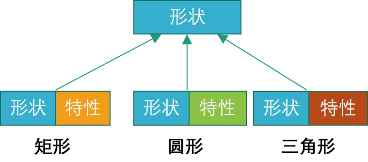
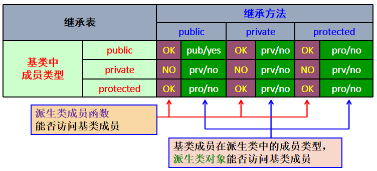
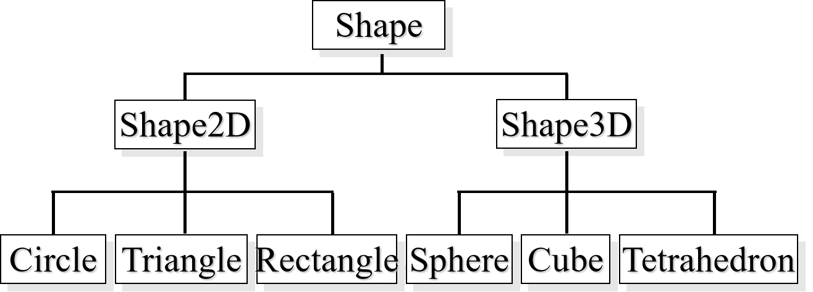
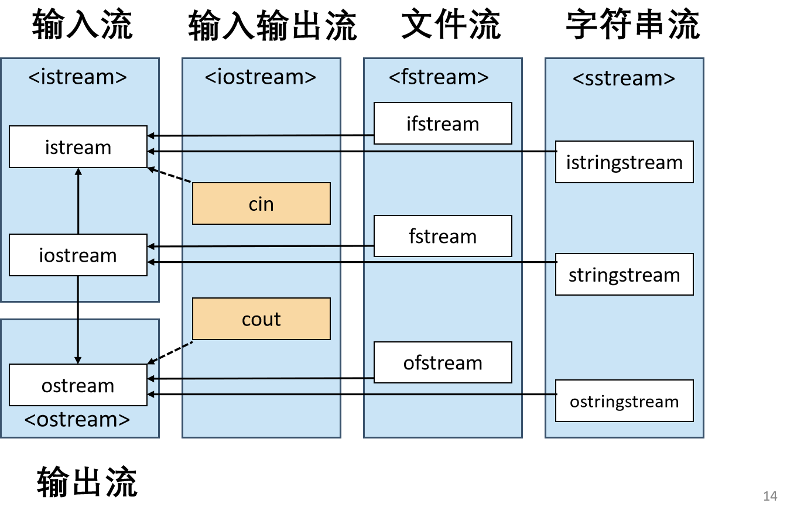

## OOP课程总结
### Windows cmd命令
### 文件操作
1. 目录结构
    **D:\example**
2. 显示当前目录
    **cd**
3. 在当前目录下新建新的目录
    **mkdir new**
4. 在当前目录下新建文件
    **type nul>a.cpp**
5. 查看当前目录下的文件
    **dir**
6. 进入上一层目录
    **cd..**
7. 进入某个目录
    **cd new**
8. 删除某个文件
    **del a.cpp**
9. 删除某个目录及目录下所有文件
    **rmdir /s new**
10. 将文件移动到某个目录
    **move a.cpp new**
11. 将文件拷贝到某个目录
    **copy a.cpp new**
12. 将某个目录下的所有文件拷贝到另一个目录(a,b是两个目录)
    **xcopy /e a b**

### 程序的编译和链接
1. 编译test.cpp,生成名为test的可执行文件
    **g++ test.cpp -o test**
2. 同上，但加上C++11标准
    **g++ -std=c++11 test.cpp -o test**
3. 一些优化指令
    **g++ -std=c++11 test.cpp -o test -O3**
4. 只编译不链接
    **g++ -c a.cpp**
5. 链接程序
    **g++ -o a(生成的exe文件名) a.o(需要的.o文件名)**
6. 多个文件的编译和链接
    **g++ -c a.cpp -o a.o**(只编译不链接)
    **g++ -c b.cpp -o b.o**(只编译不链接)
    **g++ a.o b.o -o main**(链接)
7. 编译预处理，预编译，展开宏定义和头文件等
    **g++ -E a.cpp -o a.ii**
8. 对代码进行语法检查，生成文件的汇编代码
    **g++ -S a.ii -o a.s**
9. 将汇编代码生成目标代码
    **g++ -c a.s -o a.o**
<br>

### 宏定义
* **简单的宏替换**  
```C++
#define <宏名><字符串>
#define PI 3.1415    
```
注：这种替换一般被`const`取代，进而保证**类型**正确性
```C++ 
const double PI = 3.1415926 
```
* **带参数的宏定义**
```cpp
#define <宏名>(<参数表>) <字符串>
#define sqr(x) ((x)*(x))
//sqr(3+2)->((3+2)*(3+2))=25
//这种函数一般被内联函数替代，来保证类型的正确性
//inline double sqr(double x){return x*x};
```
* **宏定义的使用**
```cpp
//方法一
#ifndef _BODYDEF_H__
#define _BODYDEF_H__ //头文件内容
#endif
//方法二
#pragma once//#pragma once比header guards更简单，且保证物理上的同一文件不被编译/读取多次，更快
```
```C++
//fun.h
int ADD(int a,int b);//原来的版本

//func.h
#ifndef FUNC_H
#define FUNC_H
int ADD(int a,int b);
#endif//增加预编译指令，防止多次包含同一头文件时出现编译错误
```
```C++
//Test.h
#pragma once
Class Test{
    //...
}//用户自定义类型通常写在头文件中，如果不使用header guards或#pragma once，当头文件被重复包含时，会导致类型的重复定义
```
```C++
//用于Debug输出
#ifdef ...
#else ...
#endif

// #define DEBUG
#ifdef DEBUG
    cout << "val:" << val << endl; 
#endif   //控制程序是否输出调试信息

```

### Makefile
```makefile
# 注释以#开头
all: main test # 默认任务
main: main.cpp student.cpp #冒号前为“目标”名,冒号后为“任务”的条件“条件”
    g++ -o main main.cpp student.cpp #指令前必须为Tab
test: student.cpp student_test.cpp
    g++ -o test student_test.cpp student.cpp
clean: 
    rm main test 
```
```makefile
#一个例子
all:test
test: product.o sum.o main.o functions.h
    g++ product.o sum.o main.o -o test
product.o: product.cpp functions.h
    g++ -c product.cpp -o product.o
sum.o: sum.cpp functions.h
    g++ -c sum.cpp -o sum.o
main.o: main.cpp functions.h
    g++ -c main.cpp -o main.o
clean:
    rm *.o
```

### extern关键字
* 变量的声明但不定义
```C++
extern int x;//声明变量
extern int arr[100];//声明数组变量
extern int ADD(int a,int b);//extern对于函数声明不是必须的
//extern通常用在全局变量在不同文件内的共享
```
```C++
//一个例子
// num.h，声明变量
extern int a;
extern int b;
extern int c[5];
extern int d;

// num.cpp，定义变量的初值
#include "num.h" 
int a = 1;
int d = 4;
int c[5];

// ex6.cpp 
#include "num.h"
int b = 2;
int main() {
	a += 1;
	d += 1;
	c[0] = 1;
	return 0;
} 
```


#### main(int argc,char** argv)
```C++
//example
#include <iostream>
#include <cstdio> 	// atoi()
int main(int argc,char** argv)
{
    int a,b;
    //std::cin>>a>>b;不采用标准输入的方式
    a = atoi(argv[1]);//字符串转整数;
    b = atoi(argv[2]);
    std::cout<< a + b << std::endl;
    return 0;
}

//cmd里面输入以下指令
//main 4 5
//输出 9
```
* `argv**`里面存的是指令本身构成的字符串数组，其中main本身存在了`argv[0]`里面，4和5分别存放在`argv[1]`和`argv[2]`里面
* `int argc`代表参数的个数
```C++
#include <iostream>
#include <cstdlib> 	// atoi()
int main(int argc, char** argv)
{	
   if (argc != 3)  {
        std::cout << "Usage: " << argv[0]  
                       << " op1 op2" << std::endl;
        return 1;
   }//加上一个判断
   int a, b;
//	std::cin >> a >> b;
	a = atoi(argv[1]);
	b = atoi(argv[2]);
	std::cout << a + b << std::endl;
	return 0;
} 
```

### 函数重载

* 同一名称，两个以上不同函数实现
```C++
//example
void print(const char* msg){
    cout<<msg<<endl;
}
void print(int score){
    cout<<score<<endl;
}

```
* 多个同名函数实现之间，必须保证至少有一个函数参数的类型有区别。返回值、参数名称等不能作为区分标识。
* **内置类型转换**
如果函数调用语句的实参与函数定义中的形参数据类型不同，且两种数据类型在C++中可以进行自动类型转换（如int和float），则实参会被转换为形参的类型
```C++
//example1
void print(float score) { 
	cout << "score = " << score << endl;
}
int main() {
	int a = 1;
	print(a);  // 此时会将a转换为float型
	return 0;
}
//example2
void print(int score) { cout << "score = " << score << endl; }
int main() {
	print(1.0);  // score = 1
	print(1.7);  // score = 1
	print(2.3);  // score = 2
	print(-3.9);  // score = -3，向零取整
	return 0;
}
//example3
void print(int score) { cout << "int = " << score << endl; }
void print(float score) { cout << "float = " << score << endl; }
int main() {
	float a = 1.0;
	print(a);  // float = 1
	return 0;
}
//当函数重载时，会优先调用类型匹配的函数实现，否则才会进行类型转换
```

### 函数的缺省值
* 函数参数可以在定义时设置默认值（缺省值），在调用该函数时，若不提供相应的实参，则编译自动将相应形参设置成缺省值
```C++
void print(const char* msg = "hello") {
		cout << msg << '#'; 
	}
	int main() {
		cout << "Beijing...";
		print();
		return 0;
	} // 输出 Beijing...hello#
```
* 有缺省值的函数参数，必须是最后一个参数,如果有多个带缺省值的函数参数，则这些函数参数都只能在没有缺省值的参数后面出现
```C++
void print(char* name, int score,char* msg = "pass") {	
		cout << name << ": " << score<< ", " << msg << endl;
	}//单缺省参数放最后
void print(char* name, int score=0, char* msg="pass")
//多缺省参数放在无缺省值参数后面
```
* 如果因为函数缺省值，导致了函数调用的**二义性**，则编译不通过
```C++
void fun(int a, int b=1) {cout << a + b << endl;}
void fun(int a) {cout << a << endl;}
//测试代码
fun(2);//编译器不知道该调用第一个还是第二个函数
```
### auto关键字
* C++11之后支持，需要加 **-std=c++11**指令
* 由编译器根据上下文自动确定变量的类型
```C++
auto i = 3; 	//i是int型变量
auto f = 4.0f; 	//f是float型变量
auto a('c'); 	//a是char型变量
auto b = a; 	//b是char型变量
auto *x = new auto(3);	//x是int*
```
* 追踪返回值的函数
    * 可以将函数返回类型的声明信息放到函数参数列表的后面进行声明
    ```C++
    int func(char* ptr, int val);//普通函数声明形式
    auto func(char* ptr, int val) -> int;//追踪返回类型在原本函数返回值的位置使用auto关键字
    ```
    * 追踪返回类型在原本函数返回值的位置使用auto关键字
* 注意事项
1. `auto` 变量必须在编译期确定其类型
2. `auto` 变量必须在定义时初始化
    ```C++
    auto a; //错误
    auto b=10,c=20.0,d='a'; //错误,没有推导为同一类型
    ```
3. 参数不能被声明为`auto`
```C++
void func(auto a) {}//错误
```
4. **auto**并不是一个真正的类型。不能使用一些以类型为操作数的操作符，如`sizeof`或者`typeid`
```C++ 
cout << sizeof(auto) << endl;//错误
```
### decltype关键字
* 重用匿名类型
```C++
struct { int d ; 
	double b; 
} anon_s; //没有名字的结构体，定义了一个变量
int main() {
	decltype(anon_s) as ;
       //定义了一个上面匿名的结构体...
}
```
* `decltype`可以对变量或表达式结果的类型进行推导
```C++
struct { char name[17]; } anon_u;
struct {
	int d;
   decltype(anon_u) id;
} anon_s[100]; // 匿名的struct数组
int main() {
	decltype(anon_s) as; // 注意变量as的类型:数组
	cin >> as[0].id.name;
}
```
* 结合`auto`和`decltype`，自动追踪返回类型
    * 可以推导返回类型（C++11）
    ```C++
    auto func(int x, int y) -> decltype(x+y)
    {
        return x+y;
    }
    ```
    * C++14中不再需要显式指定返回类型
    ```C++
    auto func(int x, int y)
    {
	return x+y;
    }
    ```
#### 使用auto关键字的好处
1. 用于代替冗长复杂、变量使用范围专一的变量声明。
```C++
std::vector<std::string> vs; 
for (std::vector<std::string>::iterator i = vs.begin();i!= vs.end(); i++) 
//简化
std::vector<std::string> vs; 
for (auto i = vs.begin(); i != vs.end();i++) 
```
2. 在定义模板函数时，用于声明依赖模板参数的变量类型。
```C++
template <typename _Tx, typename _Ty> 
void Multiply(_Tx x, _Ty y) 
{ 
	auto v = x*y; //临时变量
	std::cout << v; 
}
//使用时
Multiply(2, 3); //Multiply(int, int)
Multiply(2, 3.3); //Multiply(int, double)
```
3.结合`auto`和`decltype`，自动追踪返回类型
```C++
template <typename _Tx, typename _Ty> 
auto multiply(_Tx x, _Ty y)->decltype(x*y)
	//C++11语法，C++14可省略"->"和decltype
{ 
	return x*y; 
}
//使用时
auto a = multiply(2, 3.3);
```
<br>

### 内存的申请与释放
* 指针变量所指内存可以通过new/delete运算符在程序运行时动态生成和删除
```cpp
int * ptr = new int(10); // 单个变量
int * array = new int[10]; // 10元素数组
int * array1 = new int[10]{1,2,3,4,5,6,7,8,9,10};// 10元素数组，且初始化
delete ptr; // 删除指针变量所指单个内存单元
delete[] array; // 删除多个单元组成的内存块
```
* **0、NULL、nullptr**
    * 在c++中，NULL被定义为0
    * 在c++11之前，可以使用NULL或者0表示空指针
    * **要减少NULL的使(c++11之前)**
    ```cpp
	void f(int x, int y) {}//定义一个函数，并对它进行调用
	f(2, 0);
    void f(int x, double *y) {}//如果我们想对这个函数进行重载，并传入一个空指针作为参数
    f(2, NULL);// 实际调用的不是我们所期望的
    f(2, static_cast<double *>(0));
    //当我们使用NULL表示空指针时，容易忽略它同时是一个int型常量。
    ```
    * `nullptr`的引入（c++11）
    `nullptr`表示严格意义上的空指针,此时再执行之前的代码，不会产生错误。
    ```cpp
	void f(int x, int y) {cout<<"int"<<endl;}
	void f(int x, double *y) {cout<<"pointer"<<endl;}
	f(2,nullptr);//调用第二个
    ```
<br>

### for循环
* **基于范围的for循环**
    在循环头的圆括号中，由冒号":"分为两部分，第一部分是用于迭代的变量，第二部分则表示将被迭代的范围。
    ```cpp
    #include <iostream>
    using namespace std;
    int main() {
        int arr[3] = {1, 3, 9};
        for (int e : arr) // auto e:arr 也可以
            cout << e << endl;
        return 0;
    }
    ```
### class
* class 为用户自定义的类型
1. 包含函数与数据的特殊“结构体”，用于扩充C++语言的类型体系
2. 类中包含的函数，称为“成员函数”
3. 包含的数据，称为“成员变量”
* 成员函数必须在类内声明，但定义（实现）可以**在类内或者类外**。
* 类= “属性/数据” + “服务/函数”
```cpp
// matrix.h 在头文件中声明类class
#ifndef MATRIX_H
#define MATRIX_H
class Matrix {
	int data[6][6];//成员变量
public:
	void fill(char dir);//成员函数
};
#endif 
// matrix.cpp 在实现文件中定义成员函数
#include "matrix.h"
void Matrix::fill(char dir) //类外需要类名限定
{
    // 函数实现
}
```
* 通常，类的声明放在头文件中，而类的成员函数实现（也叫定义）则放在实现文件中。
为了便于管理和代码复用，一般是将不同的类分别保存为不同的头文件和实现文件。
4. **成员函数的两种定义方式**
```cpp
class Matrix {
public:
	void fill(char dir) { 
	//在类内定义成员函数(1)
	}
	...
};
void Matrix::fill(char dir) {
	;//在类外定义成员函数(2)
} 
```
5. **类成员的访问权限**
* `public`
    * 被public修饰的成员可以在类外访问。
* `private`
    * 默认权限
    * 被private修饰的成员不允许在类外访问。
* `protected`
    * 受保护，只有**派生类**可以访问，外部不能访问
```cpp
// matrix.h
class Matrix {
private:
	int data[6][6];
	void add(Matrix a);
public:
	void fill(char dir);
};
// matrix.cpp
#include "matrix.h"

void Matrix::add(Matrix a) {
    for(int i=0; i<6; i++){
        for(int j=0; j<6; j++) {
   data[i][j] += a.data[i][j];  // 可以在类内用“.”操作访问同一类下的私有成员
        }
    }
}
```
6. **this指针**
* 所有成员函数的参数中，隐含着一个指向当前对象的指针变量，其名称为this
```cpp
class Matrix {
public:
	void fill(char dir) {// 在类内定义成员函数
		
		this->data[0][0] = 1; //等价于 data[0][0] = 1;  
	}
};

void Matrix::fill(char dir) {// 在类外定义成员函数
	this->data[0][0] = 1;   // 等价于 data[0][0] = 1;	
}
```
### 内联函数
* 函数调用要进行一系列准备和后处理工作(压栈、跳转、退栈、返回等)，所以函数调用是一个比较慢的过程。
* 使用内联函数可以提高程序运行效率
* 使用内联函数，编译器自动产生等价的表达式。
```cpp
inline int max(int a, int b) { 
    return a > b ? a : b; 
}
cout << max(a, b) << endl;
//等价于 cout << (a > b ? a : b) << endl;
```
* 内联函数注意事项
    * **避免对大段代码使用内联修饰符。**
    内联修饰符相当于把该函数在所有被调用的地方拷贝了一份，所以大段代码的内联修饰会增加负担。（代码膨胀过大）
    * **避免对包含循环或者复杂控制结构的函数使用内联定义。**
    因为内联函数优化的，只是在函数调用的时候，会产生的压栈、跳转、退栈和返回等操作。所以如果函数内部执行代码的时间比函数调用的时间长得多，优化几乎可以忽略。
    * **避免将内联函数的声明和定义分开**
    编译器编译时需要得到内联函数的实现，因此多文件编译时内联函数先需要将实现写在头文件中，否则无法实现内联效果。
    * **定义在类声明中的函数默认为内联函数。**
    * **一般构造函数、析构函数都被定义为内联函数。**
    * **内联修饰符更像是建议而不是命令。**
    * **编译器“有权”拒绝不合理的请求**，例如编译器认为某个函数不值得内联，就会忽略内联修饰符。
    * **编译器会对一些没有内联修饰符的函数，自行判断可否转化为内联函数**，一般会选择短小的函数。

#### 内联函数与宏定义的区别
* 内联函数可以执行类型检查，进行编译期错误检查。
* 内联函数可调试，而宏定义的函数不可调试。
    * 在Debug版本，内联函数没有真正内联，而是和一般函数一样，因此在该阶段可以被调试。
    * 在Release版本，内联函数实现了真正的内联，增加执行效率。
* 宏定义的函数无法操作私有数据成员。
* 宏使用的最常见场景：字符串定义、字符串拼接、标志粘贴
* 宏定义只是拷贝代码到被调用的地方。内联函数生成的是，和函数等价的表达式。

### 构造函数
* 构造函数的作用是构造类的对象
* 构造函数没有返回值类型，函数名与类名相同
* 类的构造函数可以重载，即可以使用不同的函数参数进行对象初始化
* 构造函数可以使用初始化列表初始化成员数据
* **例子**
```cpp
class student{
    int id;
    int data;
    int height=170;//就地初始化，c++11后才支持
    public:
        student(){}//默认构造函数,如果没有任何构造函数则系统默认生成，否则不自动生成
        //student(int i):id(i){}//也是默认构造函数
        student(int id0) : id(id0){}//初始化列表
        student(int year,int order){
            id= year * 10000 + order;
        }
        student(int id0,int data0):data(data0),id(id0){}//初始化列表的成员是按照声明的顺序初始化，而不是按照出现在初始化列表中的顺序，先初始化id再data
        student(int i) :student() {id=i;}//在构造函数的初始化列表中，可以调用其他构造函数，称为“委派构造函数”
};
/*
    Student a; //调用默认构造函数
    Student a=Student(); //调用默认构造函数
    Student c(); //声明了一个返回值为Student的函数
/*
```
* **调用顺序,先调用成员变量的构造，再执行自己的构造函数**
```cpp
#include <iostream>
using namespace std;
class Member {
public:
    Member() { cout << "Member()" << endl; }
};
class Test {
public:
    Member m;
	Test() { cout << "Test()" << endl;}
};
Test t;
int main() { return 0; }
//输出
// Member()
// Test()
```
* **显式声明与删除构造函数**
```cpp
class Student {
private:
	int ID = 1; 
    char clas='a';
public:
	Student() = default;  // C++11起,显式声明默认构造函数
    Student(char x)=delete;//显式删除构造函数，避免产生未预期行为（自动类型转换）的可能性。
	Student(int i):ID(i) {}   
};
```
* 对象数组的初始化
```cpp
A a[50];//定义了一个具有50个元素的A类对象数组
A a[3] = {1, 3, 5}; //构造函数只有一个参数
// 三个实参分别传递给3个数组元素的构造函数
A a[3] = {A(1,2),A(3,5),A(0,7)};//构造函数有两个整型参数
```
### 析构函数
* 负责清除对象释放资源
* 由编译器在对象作用域结束处自动生成调用析构函数代码
    * 当执行到“包含对象定义范围结束处”时，编译器自动调用对象的析构函数。
    * 动态分配的内存是一种典型的需要释放的资源。
* 清除对象占用的资源是无条件的，不需要任何选项。因此，析构函数没有参数，且只有一个
* **例子**
```cpp
class ClassRoom {
    int num;
    int* ID_list;
public:
    ClassRoom() : num(0), ID_list(nullptr) {}
    ~ClassRoom() {  // 析构函数
        if (ID_list) delete[] ID_list; // 释放内存    
    }
};
```
* 调用顺序,先执行自己的析构函数，再调用成员变量的析构
```cpp
#include <iostream>
using namespace std;
class Member {
public:
    ~Member() { cout << "~Member()" << endl; }
};
class Test {
public:
    Member m;
	~Test() { cout << "~Test()" << endl;}
};
Test t;
int main() { return 0; }//先调用自己的析构函数，再自动调用成员变量的析构函数
//输出
// ~Test()
// ~Member()
```
* 当用户没有自定义析构函数时，编译器会自动合成一个隐式的析构函数
```cpp
class ClassRoom {
    int num;
    int* ID_list;
};
//等价于
class ClassRoom{
    int num;
    int *ID_listl
public:
    ~ClassRoom(){}//这个函数不做任何操作，因此不能delete掉指针成员，从而可能导致内存泄露
};
```
* **全局对象的构造与析构**
    * 在main()函数调用之前进行初始化。
    * 在同一编译单元中，按照定义顺序进行初始化。
        * 编译单元：通常同一编译单元就是同一源文件。
    * 不同编译单元中，对象初始化顺序不确定。
    * 在main()函数执行完return之后，对象被析构。
* 尽量少用全局对象
    * 全局对象的构造顺序不能完全确定，所以全局对象之间不能有依赖关系，否则会出现问题
    * 全局对象会增大代码的耦合性，导致程序难以复用或者测试
    * 使用参数来替代全局对象

### 引用
* 具名变量的别名:类型名 & 引用名 变量名
        ```cpp 
        int v0; int &v1=v0;//v1是变量v0的引用，它们在内存中是同一单元的两个不同名字 
        ```
* 引用必须在定义时进行初始化，且不能修改引用指向
* 被引用变量名可以是类的成员变量 `int & m = s.m;`
```cpp
#include <iostream>
using namespace std;
int main() {
    int i = 1;
    cout << "i=" << i << endl; // i=1 
    int& j = i;  // j是初始化为的i的int引用
                 // i和j是同一个变量的两个别名
    cout << "j=" << j << endl; // j=1
    i = 2;
    cout << "j=" << j << endl; // j=2，修改i，等于修改j
    j = 3;
    cout << "i=" << i << endl; // i=3，修改j，等于修改i
    return 0;
}
```
* **函数参数可以是引用类型，表示函数的形式参数与实际参数是同一个变量，改变形参将改变实参。**
```cpp
void swap(int& a,int& b){ int tmp=b;b=a;a=tmp; }
```
* 函数返回值可以是引用类型，但不得指向函数的临时变量
```cpp
#include <iostream>
using namespace std;
int a[3] = {1,3,5}; // 全局数组
int& get(int i) { return a[i]; } // 返回a[i]的引用
int main() {
    for(int i = 0; i < 3; i++) {
        cout << "old a[" << i << "]=" << get(i) << endl;
        get(i) += 1;
        cout << "new a[" << i << "]=" << get(i) << endl;
    }
    return 0;
}
/*
 old a[0]=1
 new a[0]=2
 old a[1]=3
 new a[1]=4
 old a[2]=5
 new a[2]=6
*/
```
* **引用和指针的区别**
    * 不存在空引用。引用必须连接到一块合法的内存。
    * 一旦引用被初始化为一个对象，就不能被指向到另一个对象。指针可以在任何时候指向到另一个对象。
    * 引用必须在创建时被初始化为一个对象。指针可以在初始化时置空，之后再指向对象。
* **引用的优势**
    * 更灵活地支持运算符重载 
        * 运算符重载是为了写法上的方便，如重载‘+=’，使得类的两个对象可以像数字一样相加：a+=b
        * 但如果没有引用，且在值传递对象不合适的情况下，需要使用指针进行重载，即使用者需要进行显式的取地址操作：a+=&b，这是不方便的
* 引用的特性：创建时必须初始化、初始化后便不能指向其他对象，不存在空引用，相对指针更安全

### 运算符重载
* 两种方式
    * 全局函数的运算符重载    `A operator+(A a, A b) {}`
    * 成员函数的运算符重载
    ```cpp
      class A {
	    int data;
        public:
	    A operator+(A b) {};
      };
    ```
* 可以重载的运算符
    * **双目算术运算符**
        &emsp;+(加)，-(减)，*(乘)，/(除)，% (取模)
    * **关系运算符**
        &emsp;==(等于)，!= (不等于)，< (小于)，> (大于>，<=(小于等于)，>=(大于等于)
    * **逻辑运算符**
        &emsp;||(逻辑或)，&&(逻辑与)，!(逻辑非)
    * **单目运算符**
        &emsp;+(正)，-(负)，*(指针)，&(取地址)
    * **自增自减运算符**
        &emsp;++(自增)，--(自减)
    * **位运算符**
    &emsp;| (按位或)，& (按位与)，~(按位取反)，^(按位异或)，<< (左移)，>>(右移)
    * **赋值运算符**
    &emsp;=, +=, -=, *=, /= , % = , &=, |=, ^=, <<=, >>=
    * **空间申请与释放**
    &emsp;new, delete, new[] , delete[]
    * **其他运算符**
    &emsp;()(函数调用)，->(成员访问)，,(逗号)，[](下标)
* 一些例子
    * **前缀运算符 ++**
    ```cpp
    //类内重载
    #include <iostream>
    using namespace std;
    class Test {
    public:
        int data = 1;
        Test(int d) {data = d;}
        Test& operator ++(){//前缀运算符++
            data++;
            return *this;
        }
    };	
    int main() {
        Test test(1); 
        ++test;
        return 0;
    }

    //全局重载的例子
    #include <iostream>
    using namespace std;
    class A {
    public:
        int data;
        A() { data = 0; }
        A(int i) { data = i; }
    };

    A operator++(A& a) {//前缀
        ++a.data;
        return a;
    }
    ```
    * **后缀运算符 ++**
    ```CPP
    #include <iostream>
    using namespace std;
    class Test {
    public:
        int data = 1;
        Test(int d) {data = d;}
        Test operator++ (int) {//后缀运算符 ++,哑元int为了与前缀区分
            Test test(data);
            ++data;
            return test;
        }
    };	
    int main() {
        Test test(1); 
        test++;
        return 0;
    }
    
    //全局重载的例子
    A operator ++(A& a,int)
    {
        A tmp(a.data);
        a.data++;
        return tmp;
    }
    int main() {
        A a(1);
        cout << (++a).data << endl; // 2
        cout << (a++).data << endl; // 2
        cout << a.data << endl; // 3
        return 0;
    }
    ```
    * **小括号( )**
    ```cpp
    #include <iostream>
    using namespace std;
    class Test {
    public:
    int operator()(int a,int b)
    {  return a+b;  }
    };	
    int main() {
    Test sum;
    int s = sum(3, 4); /// sum对象看上去象是一个函数，故也称“函数对象”
    cout << "a + b = " << s << endl;
    int t = sum.operator()(5, 6); 
    return 0;
    }
    ```
    * **数组下标运算符[]重载**
    ```C++
    #include <iostream>  	// cout
    #include <cstring>    // strcmp
    using namespace std;
    char week_name[7][4] = { "mon", "tu", "wed", "thu", "fri", "sat", "sun"};
    class WeekTemperature {
        int temperature[7];
        int error_temperature;
    public:
        int & operator[](const char* name)
        {
            for(int i=0;i<7;i++){
                if(strcmp(week_name[i],name)==0)
                return temperature[i];
            }
            return error_temperature;
        }
    };
    int main() 
    {
        WeekTemperature beijing;
        beijing["mon"] = -3;	
        beijing["tu"] = -1;
        cout << "Monday Temperature: "<< beijing["mon"] << endl;
        return 0;
    }//输出 Monday Temperature: -3
    ```
    * **流运算符<<和>>重载**
    ```C++
    #include <iostream>
    using namespace std;
    class Test {
        int id;
    public:
        Test(int i) : id(i) { cout << "obj_" << id << " created\n"; } 
        friend istream& operator >>(istream& in,Test &tmp);
        friend ostream& operator <<(ostream& out,const Test& tmp);
    };	
    istream& operator>>(istream& in,Test &tmp){
        in >> tmp.id;
        return in;
    }
    ostream& operator<<(ostream& out,const Test &tmp){
        out<<tmp.id<<endl;
        return out;
    }
    int main() {
        Test obj(1);	
        cout << obj;  // operator<<(cout,obj)
        cin >> obj;	 // operator>>(cin,obj) 	
        cout << obj;	
        return 0;
    }
    ```
    * **只能成员函数重载的运算符 `=,[],(),->`**

### 友元
* 被声明为友元的函数或类，具有对出现友元声明的类的private及protected成员的访问权限，即可以访问该类的一切成员。
* **友元的声明只能在类内进行。**
```cpp
class A {
    int data;//默认私有成员 
    friend void foo(A &a);
};
void foo(A &a) {
    cout << a.data << endl;//友元函数可以访问A的私有成员
}
```
* 被友元声明的函数一定不是当前类的成员函数，即使该函数的定义写在当前类内
* 当前类的成员函数也不需要友元修饰
```cpp
    #include <iostream>
    using namespace std;
    class A {
    private:
        int data;
    public:
        A(int i) : data(i) {}
        void print() { cout << data << " inside\n"; }
        friend void print(A a)// 这一行的print是全局函数
        {cout<<a.data<<" outside\n";}
    };
    int main() {
        A c(1);
        c.print(); // 1 inside
        print(c); // 1 outside
        return 0;
    }
```
* 可以声明别的类的成员函数，为当前类的友元。
    * 其中，构造函数、析构函数也可以是友元。
    ```cpp
    class Y{
        int data;
        friend void X::foo(Y);
        friend X::X(Y),X::~X();
        //X的构造函数X::X()和析构函数X::~X()为Y的友元函数，则在它们的函数体内可直接访问/修改Y的私有成员。
    };
    ```
    * 友元的声明与当前所在域是否为private或public无关
    ```cpp
    class Y {
        private:
        friend void X::foo(Y);
    };
    //等价
    class Y {
        public:
        friend void X::foo(Y);
    };
    ```
* 一个普通函数可以是多个类的友元函数
```cpp
class Y;
class X
{
    int data;
    friend void show(X &x,Y &y);
};
class Y
{
    int data;
    friend void show(X &x,Y &y);
};
void show(X& x,Y&y)
{
    cout<< x.data<<" "<<y.data<<endl;
}
```
* **友元类**
    * 可对class/struct/union进行友元声明，代表该类的所有成员函数均为友元函数
    * 对基础类型的友元声明会被忽略（因为没有实际价值）。编译器可能会发出警告，但不会认为是错误。
    ```cpp
    class Y{};//定义类Y，且Y能访问A的所有成员
    class A{
        int data;// 私有数据成员
        friend class X; // 友元类前置声明（详细类型指定符）
        friend Y; // 友元类声明（简单类型指定符） (C++11起)
    };
    class X{};// 定义类X，X能访问A的所有成员
    ```
* 注意事项
    * **非对称关系，朋友不一定把你当朋友。**
        * 类A中声明B是A的友元类，则B可以访问A的私有成员，但A不能访问B的私有成员。
    * **友元不传递，朋友的朋友不是你的朋友**
    * **友元不继承，朋友的孩子不是你的朋友**
    * **友元声明不能定义新的class,朋友不依赖于别人而存在**
    ```cpp
    class B {};
    class A {
        friend B;
    };//正确
    class X    
    {    
        friend class Y {};
    }//错误
    ```
### 静态变量/函数
* 静态变量:使用`static`修饰的变量
    * 定义示例: `static int i = 1;`
    * 初始化: **初次定义时需要初始化，且只能初始化一次。**
    * 静态局部变量存储在静态存储区，生命周期将持续到整个程序结束
    * 静态全局变量是内部可链接的，作用域仅限其声明的文件，不能被其他文件所用，可以避免和其他文件中的同名变量冲突
* 静态函数: 使用`static`修饰的函数
    * 定义: `static int func(){}`
    * 静态函数是内部可链接的，作用域仅限其声明的文件，不能被其他文件所用，可以避免和其他文件中的同名函数冲突
* 静态全局变量/静态函数和非静态全局变量/非静态全局函数的区别
    * 静态全局变量/静态函数是内部可链接的，作用域仅限其声明的文件，不能被其他文件所用
    * 非静态全局变量/非静态全局函数是外部可链接的，可以被其他文件所用
    ```cpp
    //a.cpp
    #include <iostream>
    using namespace std;
    static int i = 1;//静态全局变量，只能用于a.cpp 
    int j = 2; //非静态全局变量，可用于其他文件
    static int add_i(int k) //静态函数，只能用于a.cpp
    int add_j(int k)//非静态全局函数，可用于其他文件
    { return k+j; };
    int main() {
    cout << i << “ ” << j << endl;
    return 0;
    }
    //b.cpp
    extern int i; //链接时出错，因为i为静态全局变量，仅能用于其声明的文件a.cpp
    extern int j;
    extern int add_i(int k) {return k+i;};//链接时出错，因为add_i为静态函数，仅能用于其声明的文件a.cpp
    int add_j(int k) { return k+ij; };
    ```
* 静态数据成员：使用static修饰的数据成员，是隶属于类的，称为类的静态数据成员，也称“类变量”
    * 静态数据成员被该类的所有对象共享（即所有对象中的这个数据域处在同一内存位置）
    * 类的静态成员（数据、函数）既可以通过对象来访问，也可以通过类名来访问
        * `Classname::static_var`等价于`a.static_var`
    * 类的静态数据成员要在实现文件中赋初值 `Type ClassName::static_var = Value;`
    * 和全局变量一样，类的静态数据成员在**程序开始前初始化**
    * 静态数据成员应该**在.h文件中声明**，**在.cpp文件中定义**。
    * 如果在.h文件中同时完成声明和定义，会出现问题。
        * 包含了该头文件的所有源文件中都定义了这些静态成员变量，即该头文件被包含了多少次，这些变量就定义了多少次。
        * 同一个变量被定义多次，会导致链接无法进行，程序编译失败。
    ```cpp
    //Test.h
    class Test{
        public:
            static int count;
        Test();
        ~Test();
    };
    //Test.cpp
    #include "Test.h"
    int Test::count=0;
    Test::Test(){ count++; }
    Test::Test(){ count--; }
    //main.cpp
    #include<iostream>
    #include "Test.h"
    using namespace std;
    int main(){
        Test t[10];
        cout << "Test#: " << Test::count << " or " << t[0].count << endl;//通过类名或对象访问静态数据成员
        return 0;

    }
    ```
* **静态成员函数**:在返回值前面添加`static`修饰的成员函数，称为类的静态成员函数
    * 和静态数据成员类似，类的静态成员函数既可以通过对象来访问，也可以通过类名来访问
            `ClassName::static_function`或者`a.static_function`
    * 静态成员函数不能访问非静态成员
        * 静态成员函数属于整个类，在类实例化对象之前已经分配了内存空间。
        * 类的非静态成员必须在类实例化对象后才分配内存空间。
        * 如果使用静态成员函数访问非静态成员，相当于没有定义一个变量却要使用它。
```cpp
    #include <iostream>
    using namespace std;
    class Test{
    public:
        static int count;
        float value;
        Test(int v):value(v){count++;}
        ~Test(){ count--; }
        static int how_many(){return count;}
    };
    int Test::count=0;
    int main()
    {
        Test t(2);
        cout<<"Test#:"<<Test::how_many()<<endl;//Test#: 1
        cout<<"Test.value:"<<t.value<<endl;//Test.value: 2
        return 0;
    }
```
```cpp
    #include <iostream>
    using namespace std;
    class A {  
        int data;
    public:    
        static void output() {  
            cout << data << endl; // 编译错误
        }  
    }; 
```
### 常量
* 常量关键字`const`常用于修饰变量、引用/指针、函数返回值等
    * 修饰变量时如`const int n = 1;`必须就地初始化，该变量的值在其生命周期内都不会发生变化
    * 修饰引用/指针时如`int a=1; const int& b=a;`不能通过该引用/指针修改相应变量的值，常用于函数参数以保证函数体中无法修改参数的值
    * 修饰函数返回值时如`const int* func() {}`函数返回值的内容（或其指向的内容）不能被修改
    * 修饰函数返回值时如`const int* func(){}`函数返回值的内容（或其指向的内容）不能被修改
#### 常量数据成员
* 使用const修饰的数据成员，称为类的**常量数据成员**，在对象的整个生命周期里不可更改
* **常量数据成员初始化**
    * 构造函数的**初始化列表**中被初始化
    * **就地初始化**
    * **不允许**在构造函数的函数体中通过赋值来设置
```cpp
    #include <iostream>
    using namespace std;
    class Student {
    const int ID; //常量数据成员
    const int age = 9; // 就地初始化
    public:
    Student(int id) : ID(id) {} // 通过初始化列表初始化常量数据成员
    int Next() { 
        ID++; //该处会出现编译错误，因为常量数据成员不可更改
        return ID; 
    }
    };
    int main() {
    Student stu(20151145);
    cout << "ID = " << stu.Next() << endl;
    return 0;
    }
```
#### 常量成员函数
* 用`const`来修饰的成员函数，称为常量成员函数
* 常量成员函数的访问权限：实现语句不能修改类的非静态数据成员，即不能改变对象状态
    * `Returntype f() const {}` 是一个常量成员函数，函数内部不能修改类的数据成员
    * `const Returntype f() {}` 是一个返回值为常量的函数，返回值不能被修改
* 若对象被定义为常量`(const ClassName a;)`则它只能调用以const修饰的成员函数
    * 对象中的“数据”不能变
```cpp
#include <iostream>
using namespace std;
class Student{
    int id;
    public:
    Student(int id0):id(id0){}
    int MyID() const{ return id; } //常量成员函数
    int Next() const{ id++; return id; }//编译错误，常量成员函数不能修改数据成员
    int Who() {return id;}
};
int main()
{
    Student stu1(10000000);
    cout<<"ID_1 = "<<stu1.MyID() << endl;
    cout<<"ID_2 = "<<stu1.Who() << endl;
    const Student stu2(20000000);
    cout << "id_1 : " << stu2.MyID() << endl;
    cout << "id_2 :" << stu2.Who() << endl; //编译错误，常量对象不能调用非常量成员函数
    return 0;
}
```
#### 常量静态变量
* **既是常量也是静态的变量**
    * 作为类的常量变量
* **常量静态变量需要在类外进行定义**
    * 和静态变量一样
    * 但有两个例外：`int`和`enum`类型可以就地初始化
* **常量静态变量和静态变量一样，满足访问权限的任意函数均可访问，但都不能修改**
    * 不存在常量静态函数
    * 常量/非常量函数的访问权限需要通过实例化后的对象是否为常量对象来决定。**常量修饰函数必须绑定在对象上**
    * 因此，静态函数和常量函数互相冲突
```cpp
class foo{
    static const char* cs;//错误，不可就地初始化
    static const int i=3;//可以就地初始化
    static const int j;//也可以在类外定义
};
const char* foo::cs="foo C string";
const int foo::j=4;
```
#### 总结表
||静态数据成员|常量数据成员|常量静态数据成员(除int, enum外)|常量静态数据成员(int, enum)|
|:---:|---|---|---|---|
|**初始化**|-|-|-|-|
|就地初始化||:white_check_mark:||:white_check_mark:|
|初始化列表初始化||:white_check_mark:|||
|构造函数体内初始化|||||
|类外初始化|:white_check_mark:||:white_check_mark:|:white_check_mark:|
|**访问**|-|-|-|-|
|普通成员函数|:white_check_mark:|:white_check_mark:|:white_check_mark:|:white_check_mark:|
|静态成员函数|:white_check_mark:||:white_check_mark:|:white_check_mark:|
|常量成员函数|:white_check_mark:|:white_check_mark:|:white_check_mark:|:white_check_mark:|
|**修改**|-|-|-|-|
|普通成员函数|:white_check_mark:||||
|静态成员函数|:white_check_mark:||||
|常量成员函数|:white_check_mark:||||
#### 常量对象的构造与析构
* **常量全局/局部对象的构造与析构时机和普通全局/局部对象相同**
#### 静态对象的构造与析构
* **静态全局对象的构造与析构时机和普通全局对象相同**
* **函数中静态对象：在函数内部定义的静态局部对象**
    * 在程序执行到该静态局部对象的代码时被初始化。
    * 离开作用域不析构。在main()函数结束后被析构。
    * 第二次执行到该对象代码时，不再初始化，直接使用上一次的对象。
```cpp
#include <iostream>
using namespace std;
void fun(int i){
    static int m=i;
    cout<<m;
}
int main()
{
    for(int i=1;i<=5;i++)
    {fun(i);}
    return 0;
}//输出 11111
```
* **类静态对象：类A的对象a作为类B的静态变量**
    * a的构造与析构表现和全局对象类似，即在main()函数调用之前进行初始化，在main()函数执行完return，程序结束时，对象被析构
    * 和B是否实例化无关
    ```cpp
    #include <bits/stdc++.h>
    using namespace std;
    class A
    {	
    public:
        int data; 
        A(int x){data=x;}
        void print()
        { cout<<data; }
    };
    class B
    {
    public:
        static A a;
    };
    A B::a(5);//类外初始化
    int main()
    {
        B::a.print();
        return 0;
    }//输出5
    ```
    ```cpp
    //常量/静态对象的构造与析构实例
    #include <iostream>
    using namespace std;
    class A {
        const char* s;
    public:
        A(const char* str):s(str) { 
            cout << s << " A constructing" << endl;
        }
        ~A() { 
            cout << s << " A destructing" << endl; 
        }
    };
    class B {
        static A a1;
        const A a2;
    public:
        B(const char* str):a2(str) { }
        ~B() { }
    };
    void fun() {
        static A static_obj("static");
    }
    const A c_a("const c_a");
    static A s_a("static s_a");
    A B::a1("static B::a1");

    运行结果：
    /*
    const c_a A constructing
    static s_a A constructing
    static B::a1 A constructing
    main starts
    static main_b A constructing
    static A constructing
    main ends
    static A destructing
    static main_b A destructing
    static B::a1 A destructing
    static s_a A destructing
    const c_a A destructing
    */
    ```
* 参数对象的构造与析构
    * **如果是值传递**
    ```cpp
    void fun(A b) {
        cout << "In fun: b.s=" << b.s << endl;
    }
    fun(a);
    //在函数被调用时，b被构造，调用拷贝构造函数（以后内容）进行初始化。默认情况下，对象b的属性值和a一致。
    //在函数结束时，调用析构函数，b被析构。
    ```
    * **如果参数是类对象的引用**
    ```cpp
    void fun(A &b)
    {  cout << "In fun: b.s=" << b.s << endl;  }
    fun(a);
    //在函数被调用时，b不需要初始化，因为b是a的引用。
    //在函数结束时，也不需要调用析构函数，因为b只是一个引用，而不是A的对象。
    ```
    * **如果一个类含有指针成员**
    ```cpp
    #include <iostream>
    using namespace std;
    class A {
    public:
        int *data; // 注意这是一个指针
        A(int d) {data = new int(d);}
        ~A() {delete data;} // 注意这里，释放之前申请的内存
    };
    void fun(A a) { 
        cout << *(a.data) << endl;
    }
    int main() {
        A object_a(3);
        fun(object_a);
        return 0; // 在程序结束时会出错
        //对象a和对象object_a的data成员一样（地址一样）,所以delete的时候释放的是同一块内存地址。
    }
    ``` 
    * **尽量使用对象引用作为参数，这样做还可以减少时间开销**
    ```cpp
    class A {
    public:
        int *data;
        A(int d) {data = new int(d);}
        ~A() {delete data;} // 注意这里，释放之前申请的内存
    };
    void fun(A &a) { // 这种情况下，程序不会出现问题
        cout << *(a.data) << endl;
    }
    int main() {
        A object_a(3);
        fun(object_a);
        return 0;
    }
    ```
#### 对象的new和delete
* **new**
    * 生成一个类对象，并返回地址（构造函数会被调用）
    * `A *pA = new A(some parameters);`
* **delete**
    * 删除该类对象，释放内存资源（析构函数会被调用）
    * `delete pA;`
* **生成一个类对象的数组(实现细节和编译器实现有关，并不通用于所有编译器)**
    * `A *pA =new A[3];`
        * 调用operator new[ ] 标准库函数来分配足够大的原始未类型化的内存。注意要多出4个字节来存放数组的大小。
        * 在刚分配的内存上运行构造函数对新建的对象进行初始化构造。
        * 返回指向新分配并构造好的对象数组的指针。
    * `delete []pA;`
        * 对数组中各个对象运行析构函数，数组的维数保存在pA前4个字节里。
        * 调用operator delete[ ]标准库函数释放申请的空间。不仅仅释放对象数组所占的空间，还有上面的4个字节。
* **new和detele要配套使用**
    * new 和 delete
    * new[] 和 delete[]
#### 参数中的常量和常量引用
* **最小特权原则**：给函数足够的权限去完成相应的任务，但不要给予他多余的权限。
    * 例如函数`void add(int& a, int& b)`如果将参数类型定义为`int&`则给予该函数在函数体内修改a和b的值的权限。
* 如果我们不想给予函数修改权限，则可以在参数中使用**常量/常量引用**
    * `void add(const int& a,const int& b)`此时函数中仅能读取a和b的值，无法对a, b进行任何修改操作。

### 拷贝构造函数
* 拷贝构造函数是一种特殊的构造函数，它的参数是语言规定的，是**同类对象的常量引用**
```cpp
class Test{
    int data;
    public:
    Test(){}
    Test(const Test& src){data=src.data;}//拷贝构造函数
};
//被调用的三种情况
void Func(Test a){}//函数调用时以类的对象为形参
Test Func(void){Test a;return a;}//函数返回类对象
int main()
{
    Test a; 
    Test b(a); 
    Test c=a;//用一个类对象定义另一个新的类对象
    return 0;
}
```
* 类的新对象被定义后，会调用构造函数或拷贝构造函数。如果调用拷贝构造函数且当前没有给类显式定义拷贝构造函数，编译器将自动合成**隐式定义的拷贝构造函数**，其功能是**递归调用**所有数据成员的拷贝构造函数或拷贝赋值运算符。
* 对于基础类型来说，默认的拷贝方式为位拷贝(Bitwise Copy)，即直接对整块内存进行复制。
* 隐式定义的拷贝构造函数在遇到指针类型成员时可能会出错,导致多个指针类型的变量指向同一个地址。
```cpp
class Test{
    int data;
    char* buffer;
    public:
        Test(){}//默认构造函数
        ~Test(){}//析构函数
};
int main()
{
    Test a; Test b=a;//使用自动合成的隐式定义的拷贝构造函数,从而会将a和b的buffer指针都指向同一个地址，从而造成问题。
```
* 执行顺序
```cpp
//以这个函数为例
Myclass func(Myclass c) {
	Myclass tmp;	
	return tmp;
}
//先调用拷贝构造函数构造 形参c
//再调用默认构造函数构造 局部变量tmp
//再用拷贝构造函数构造返回值
//析构tmp
//析构c
```
* 拷贝构造函数的问题
    * 当对象很大的时候，频繁的拷贝构造会造成程序效率的显著下降。
    * 当对象含有指针的时候，浅拷贝会导致两个指针指向同一块地址。
    * 解决办法
        * 使用引用/常量引用传参数或返回对象；
        `func(Myclass a)`换为`func(const Myclass& a)`
        `Myclass func()`换为`Myclass& func()`
        * 将拷贝构造函数声明为private；
        ```cpp
        class MyClass{
        MyClass(const MyClass&){} //拷贝构造函数私有化
        public: MyClass()=default; 
        }
        ```
        * 用delete关键字让编译器不生成拷贝构造函数的隐式定义版本。
        ```cpp
        class MyClass{  
            public:MyClass()=default;    
            MyClass(const MyClass&)=delete; 
        }
        ```
### 左值和右值
* **左值**：可以取地址、有名字的值。
* **右值**：不能取地址、没有名字的值;常见于常值、函数返回值、表达式
```cpp
int a=1;
int b=func();
int c=a+b;
//其中a、b、c为左值，1、func函数返回值、a+b的结果为右值。
```
* 左值可以取地址，并且可以被&引用(左值引用)
```cpp
int *d=&a;//正确
int &d=a;//正确
int *e=&(a+b);//错误
int &e=a+b;//错误
```
* 右值无法取地址，但可以被&&引用(右值引用)，右值引用无法绑定左值
```cpp
int &&e=a+b;//正确
int &&e=a;//错误
```
* 左值引用能绑定左值,右值引用能绑定右值,但常量左值引用能也绑定右值
```cpp
const int &e=3;
const int &e=a*b;
```
||非常量左值|常量左值|右值|
|---|---|---|---|
|非常量左值引用|:white_check_mark:|||
|常量左值引用|:white_check_mark:|:white_check_mark:|:white_check_mark:|
|右值引用|||:white_check_mark:|
* **所有的引用（包括右值引用）本身都是左值**，结合该规则和上表便可判断各种构造函数、赋值运算符中传递参数和取返回值的引用绑定情况。
```cpp
#include <iostream>
using namespace std;
void ref(int &x) {
	cout << "left " << x << endl;
}
void ref(int &&x) {
	cout << "right " << x << endl;
}
int main() {
	int a = 1;
	ref(a);
	ref(2); //2是一个常量
	return 0;
}//输出
// left 1
// right 2
```
```cpp
#include <iostream>
using namespace std;
void ref(int &x) {
	cout << "left " << x << endl;
}
void ref(int &&x) {
	cout << "right " << x << endl;
	ref(x); //注意，此时x本身是一个左值，所以此处调用上一个函数
}
int main() {
	ref(1); //1是一个常量
	return 0;
}//输出
//right 1
//left 1
```
#### 移动构造函数
* 右值引用可以**延续即将销毁变量的生命周期**，用于构造函数可以**提升处理效率**，在此过程中尽可能少地进行拷贝。
* 使用右值引用作为参数的构造函数叫做**移动构造函数。**
`classname(const classname& variablename);//拷贝构造函数`
`classname(classname&& variablename);//移动构造函数`
```cpp
class Test{
public:
    int *buf;
    Test(){
        buf=new int[10];
    }
    ~Test(){
        if(buf) delete[] buf;
    }
    Test(const Test& t):buf(new int[10]){
        for(int i=0;i<10;i++)
            buf[i]=t.buf[i];//拷贝数据
    }
    Test(Test&& t): buf(t.buf){//直接复制地址，避免拷贝
        t.buf=nullptr;//将原来指针置空
    }
};
```
* 仅通过**移动构造函数**可以加快**右值初始化**的构造速度，还可以通过`std::move`函数配合移动构造函数来加快**左值初始化的构造速度**
    `std::move`
    * 输入：左值（包括变量等，该左值一般不再使用）
    * 返回值：该左值对应的右值
        ```cpp
        Test a;
        Test b=std::move(a);//对于上个实例中定义的Test类，该处调用移动构造函数对b进行初始化
        ```
    * move函数本身不对对象做任何操作，仅做类型转换，即转换为右值。移动的具体操作在**移动构造函数**内实现。
    * 右值引用结合`std::move`可以显著提高swap函数的性能。`std::move`引起移动构造函数或移动赋值运算的调用
    ```cpp
    template <class T>
    swap(T &a,T &b){
        T tmp(a);//copy a to tmp
        a=b;//copy b to a
        b=tmp;//copy tmp to b
    }
    //移动操作
    template<class T>
    swap(T& a,T& b){
        T tmp = std::move(a);
        a = std::move(b);
        b = std::move(tmp);
    }
    ```
* **拷贝/移动构造函数的调用时机**
    * 拷贝构造函数的形参类型为**常量左值引用**，可以绑定**常量左值、左值和右值**
    * **移动构造函数**的形参类型为**右值引用**，可以绑定**右值**
    * 引用的绑定存在优先级，例如**常量左值引用**和**右值引用**均能绑定右值，当传入实参类型为**右值**时优先匹配形参类型为**右值引用**的函数。
    * 拷贝构造函数的常见调用时机
        * 用一个类对象/引用/常量引用初始化另一个新的类对象
        * 以类的对象为函数形参，传入实参为类的对象/引用/常量引用
        * 函数返回类对象（类中未显式定义移动构造函数，不进行返回值优化）
    * 移动构造函数的常见调用时机
        * 用一个类对象的右值初始化另一个新的类对象（常配合`std::move`函数一起使用）
        `Test b=func(a);Test b=std::move(a);`
        * 以类的对象为函数形参，传入实参为类对象的右值
        `func(Test());func(std::move(a));`
        * 函数返回类对象（类中显式定义移动构造函数，不进行返回值优化）
        `{return Test();or return tmp;}`
### 赋值运算符
#### 拷贝赋值运算符
* 已定义的对象之间相互赋值，可通过调用对象的“拷贝赋值运算符函数”来实现的
```cpp
ClassName a;
ClassName b;
a=b;
//拷贝运算符
ClassName a=b;
//拷贝构造函数
```
```cpp
Test& operator=(const Test& right){//重要
    if(this==&right) cout<<"same obj!\n";
    else{
        for(int i=0;i<10;i++)
        buf[i]=right.buf[i];
    }
    return *this;//重要
}//赋值重载函数必须要是类的非静态成员函数，不能是友元函数。
```
#### 移动赋值运算符
```cpp
Test& operator=(Test&& right){
    if(this==&right) cout<<"same obj!\n";
    else{
        this->buf=right.buf;
        right.buf=nullptr;
    }
    return *this;
};
```
#### 拷贝/移动赋值运算符的调用时机
* 和拷贝/移动构造函数的调用时机类似，主要判断依据是**引用的绑定规则**。
* **编译器自动合成的函数/运算符**
    * 默认构造函数
    * 拷贝构造函数
    * 移动构造函数（C++11起）
    * 拷贝赋值运算符
    * 移动赋值运算符（C++11起）
    * 析构函数
### 类型转换
* 当编译器发现表达式和函数调用所需的数据类型和实际类型不同时，便会进行**自动类型转换**。
* 自动类型转换可通过定义特定的**转换运算符**和**构造函数**来完成。
* 除自动类型转换外，在有必要的时候还可以进行**强制类型转换**。
* 自动类型转换的方法
```cpp
// 在源类中定义“目标类型转换运算符”
#include<iostream>
using namespace std;
class Dst{//目标类Destination
public:
    Dst(){cout<<"Dst::Dst()"<< endl; }
};
class Src{//源类Source
public:
    Src(){cout<<"Src::Src()"<<endl;}
    operator Dst()const{
        cout<<"Src::operator Dst() called"<<endl;
        return Dst();
    }
};
```
```cpp
//在目标类中定义"源类对象作参数的构造函数"
#include <iostream>
using namespace std;
class Src;//前置类型声明，因为在Dst中要用到Src类
class Dst{
public:
    Dst(){cout<<"Dst::Dst()"<<endl;}
    Dst(const Src& s){
        cout<<"Dst::Dst(const Src&)"<<endl;
    }
};
class Src{
public:
    Src(){cout<<"Src::Src()"<<endl;}
};
```
```cpp
void Transform(Dst d) {} 
int main()
{
    Src s;
    Dst d1(s);
    Dst d2 = s; 
    Transform(s);    
    return 0;
}
//两种方法任选一种，以上代码均可运行。
//两种自动类型转换的方法不能同时使用，使用时请任选其中一种。
```
```cpp
//下面类型转换运算符代码哪些语句有错，原因是？
class SmallInt;
operator int(SmallInt&); //错误：不是成员函数
class SmallInt{
public:
	int operator int()const;	//错误：不能返回类型	
    operator int(int =0)const; //错误：参数列表不为空
	operator int*() const {return 42;} //错误：42不是一个合法指针,本意：将SmallInt对象转换为int* 指针
};
```
* **禁止自动类型转换**
* 如果用`explicit`修饰类型转换运算符或类型转换构造函数，则相应的类型转换必须显式地进行
    * `explicit operator Dst() const;`
    * `explicit Dst(const Src& s);`
* **强制类型转换**
    * `const_cast`，去除类型的`const`或`volatile`属性。
    * `static_cast`，类似于C风格的强制转换。无条件转换，静态类型转换。
    * `dynamic_cast`，动态类型转换，如派生类和基类之间的多态类型转换。
    * `reinterpret_cast`，仅仅重新解释类型，但没有进行二进制的转换。
  
### 组合
* 如果对象a是对象b的一个组成部分,则称b为a的整体对象,a为b的部分对象。并把b和a之间的关系，称为**整体－部分**关系。
```cpp
//实现组合的两种方式
#include <iostream>
using namespace std;
class Wheel{
	int _num;
public:
	void set(int n){_num=n;}
};
class Engine{
public:
  int _num;
  void set(int n){_num=n;}
};
class Car{
private:
    Wheel w;
public:
    Engine e;//公有成员，直接访问其借口
    void setWheel(int n){w.set(n);}//提供私有成员的整体访问接口
};
int main()
{
    Car c;
    c.e.set(1);//公有成员，直接访问其借口
    c.setWheel(4);//提供私有成员的整体访问接口
    return 0;
}
```
* 子对象构造时若需要参数，则应在当前类的**构造函数的初始化列表**中进行。
* 对象构造与析构函数的次序
    * 先完成子对象的构造，再完成当前对象构造。
    * 子对象的构造次序仅由在类中**声明的次序**所决定。
    * 析构函数的次序与构造函数相反，即先析构子对象，再析构当前对象。
```cpp
//对象组合例子以及构造与析构
#include<iostream>
using namespace std;
class S1{//部分类1
    int ID;
public:
    S1(int id): ID(id){cout << "S1(int)" << endl; }
    ~S1(){cout << "~S1()" << endl;}
};
class S2{//部分类2
public:
    S2() { cout << "S2()" << endl; }
    ~S2() { cout << "~S2()" << endl; }
};
class C3{
    int num;
    S1 sub1;//构造函数带参数
    S2 sub2;//构造函数不带参数
    public:
    C3():num(0),sub1(123){cout << "C3()" << endl;}// 构造函数初始化列表中构造子对象
    C3(int n):num(n),sub1(123){cout << "C3(int)" << endl;}
    C3(int n,int k):num(n),sub1(k){cout << "C3(int, int)" << endl;}
    ~C3() {cout << "~C3()" << endl;}
};
int main()
{
    C3 a,b(1),c(2),d(3,4);
    return 0;
}
```
* **组合对象的拷贝构造和拷贝赋值**
    * 如果调用拷贝构造函数但没有显式定义拷贝构造函数，编译器将提供"隐式定义的拷贝构造函数"。功能为：
        * 递归调用所有子对象的拷贝构造函数
        * 对于基础类型，采用位拷贝
    * **赋值运算的默认操作类似**
```cpp
#include<iostream>
using namespace std;
class C1{//部分类1
public:
    int i;
    C1(int n):i(n){}
    C1(const C1&other):i(other.i) { cout << "C1(const C1 &other)" << endl; }
};

class C2{//部分类2
public:
    int j;
    C2(int n):j(n){}
    C2& operator=(const C2& other)
    {
        if(this!=&other){
            j=right.j;
            cout << "operator=(const C2&)" << endl;
        }
        return *this;
    }
};

class C3{
public:
    C1 c1;
    C2 c2;
    C3():c1(0),c2(0){}
    C3(int i,int j):c1(i),c2(j){}
    void print(){cout<<"c1.i = " << c1.i << " c2.j = " << c2.j << endl;}
};
int main(){
    C3 a(1,2);
    C3 b(a);//C1执行显式定义的拷贝构造,C2执行隐式定义的拷贝构造
    cout<<"b:";
    b.print();
    cout<<endl;
    
    C3 c;
    cout<<"c: ";
    c.print();
    c=a;//C1执行隐式定义的拷贝赋值，C2执行显式定义的拷贝赋值

    cout<<"c:";
    c.print();
    return 0;
}
```

### 继承
* "一般－特殊"结构，也称"分类结构"，是由一组具有"一般－特殊"关系的类所组成的结构。
    * 如果类A具有类B全部的属性和服务，而且具有自己特有的某些属性或服务，则称A为B的特殊类，B为A的一般类。
    <br>
    
* 被继承的已有类，被称为**基类(base class)**，也称“父类”。
通过继承得到的新类，被为**派生类(derived class)**，也称“子类”、“扩展类”。
* 三种继承方式:`public`,`private`,`protected` 继承(很少被使用)
  默认继承方式为private继承
  ```cpp
  class Derived: [private] Base{};
  class Derived: public: Base{};
  class Derived: protected Base{};//很少被使用
  ```
* **不能继承的成员**
    * **构造函数**：创建派生类对象时，必须调用派生类的构造函数，派生类构造函数调用基类的构造函数，以创建派生对象的基类部分。C++11新增了继承构造函数的机制（使用using），但默认不继承。
    * **析构函数**：释放对象时，先调用派生类析构函数，再调用基类析构函数
    * **赋值运算符**：编译器不会继承基类的赋值运算符（参数为基类），但会自动合成隐式定义的赋值运算符（参数为派生类），其功能为调用基类的赋值运算符。
    * **友元函数**：不是类成员
```cpp
#include<iostream>
using namespace std;
class Base{
public:
    int k=0;
    void f(){cout<<"Base::f()" << endl;}
    Base & operator=(const Base& right){
        if(this!=&right){
            k=right.k;
            cout<<"operator= (const Base &right)" << endl;
        }
        return *this;
    }
};
class Derived:public Base{};
int main()
{
    Derived d,d1;
    cout<<d.k<<endl;//Base数据成员被继承
    d.f();
    Base e;
    //d=e;//编译错误，Base的赋值运算符不被继承
    d=d1;
    return 0;
}//输出
//0
//Base::f()
//operator= (const Base &right)
```
* **派生类对象的构造与析构过程**
    * 基类中的数据成员，通过继承成为派生类对象的一部分，需要在构造派生类对象的过程中调用**基类构造函数**来正确初始化。
        * 若没有显式调用，则编译器会**自动调用基类的默认构造函数**。
        * 若想要显式调用，则只能在**派生类构造函数的初始化成员列表**中进行，既可以调用基类中不带参数的默认构造函数，也可以调用合适的带参数的其他构造函数。
    * **先执行基类**的构造函数来初始化继承来的数据，**再执行派生类**的构造函数。
    * 对象析构时，先执行**派生类析构函数**，再执行由编译器自动调用的**基类的析构函数。**
    ```cpp
    #include<iostream>
    using namespace std;
    class Base
    {
        int data;
        public:
        Base():data(0){cout<<"Base::Base(" << data << ")\n";}//默认构造函数
        Base(int i):data{cout<<"Base::Base(" << data << ")\n";}
    };

    class Derived : public Base {
    public:
        Derived(){cout << "Derive::Derive()" << endl; }// 无显式调用基类构造函数，则调用基类默认构造函数
        Derived(int i):Base(i){cout << “Derive::Derive()” << endl; }//显式调用基类构造函数
    };
    int main()
    {
        Derived obj1;
        Derived obj2(123);
        return 0;
    }
    ```
    * 当基类存在多个构造函数时，使用`using`会给派生类自动构造多个相应的构造函数。
    ```cpp
    #include<iostream>
    using namespace std;
    class Base{
        int data;
    public:
        Base(int i):data(i){ cout << "Base::Base(" << i << ")\n"; }
        Base(int i,int j){cout << "Base::Base(" << i << "," << j << ")\n";}
    };
    class Derived:public Base{
    public:
        using Base::Base;//相当于定义了 Derive(int i):Base(i){};和 Derive(int i, int j):Base(i，j){};
    };
    int main(){
        Derived obj1(123);
        Derived obj2(123,456);
        return 0;
        //这个例子里面不能用 Derived obj构造对象，派生类使用了继承构造函数，编译器就不会再为派生类生成隐式定义的默认构造函数。
        //如果基类的某个构造函数被声明为私有成员函数，则不能在派生类中声明继承该构造函数。
    }
    ```
* **成员访问权限**
    * 基类中的**私有成员**，不允许在派生类成员函数中访问，也不允许派生类的对象访问它们。
    * 基类中的**公有成员**
        * 允许在派生类成员函数中被访问
        * 若是使用`public`继承方式，则成为派生类公有成员，可以被派生类的对象访问；
        * 若是使用`private/protected`继承方式，则成为派生类私有/保护成员，不能被派生类的对象访问。若想让某成员能被派生类的对象访问，可在派生类`public`部分用关键字`using`声明它的名字。
    * 基类中的**保护成员**,保护成员允许在**派生类成员函数中**被访问，但**不能被外部函数**访问。
    * **基类成员访问权限与三种继承方式**
        * `public`继承:基类的公有成员，保护成员，私有成员作为派生类的成员时，都保持原有的状态。
        * `private`继承:基类的公有成员，保护成员，私有成员作为派生类的成员时，都作为私有成员。
        * `protected`继承:基类的公有成员，保护成员作为派生类的成员时，都成为保护成员，基类的私有成员仍然是私有的。
    
### 重写隐藏
* 在**派生类**中重新定义**基类函数**，实现派生类的特殊功能。屏蔽了基类的**所有其它同名函数**。函数名必须相同，函数参数可以不同
* 可以在派生类中通过`using 类名::成员函数名;` 在派生类中“恢复”指定的基类成员函数（即去掉屏蔽），使之重新可用
```cpp
#include<iostream>
using namespace std;
class T {};
class Base{
public:
    void f(){cout << "Base::f()\n";}
    void f(int i) { cout << "Base::f(" << i << ")\n";}
    void f(double d) { cout << "Base::f(" << d << ")\n";}
    void f(T){cout << "Base::f(T)\n";}
};
class Derive:public Base{
public:
    //using Base::f;使用using 基类名::函数名;恢复基类函数
    void f(int i){cout << "Derive::f(" << i << ")\n";}
};
int main()
{
    Derive d;
    d.f(10);
    d.f(4.9);		/// 编译警告。执行自动类型转换。4.9->4
    //  d.f();		/// 被屏蔽,编译错误,如果恢复可使用
    //  d.f(T());	/// 被屏蔽,编译错误,如果恢复可使用
    return 0;
}//输出
// D1::f(10)
// D1::f(4)
```
#### using关键字
* 继承基类构造函数 `using Base::Base;`
* 恢复被屏蔽的基类成员函数 `using Base::f;`
* 指示命名空间 `using namespace std;`
* 将另一个命名空间的成员引入当前命名空间 `using std::cout;`
* 定义类型别名 `using a=int;`
#### 多重继承
* 派生类同时继承多个基类
* **数据存储**：如果派生类D继承的两个基类A,B，是同一基类Base的不同继承，则A,B中继承自Base的数据成员会在D有两份独立的副本，可能带来数据冗余。
* **二义性**：如果派生类D继承的两个基类A,B，有同名成员a，则访问D中a时，编译器无法判断要访问的哪一个基类成员。
```cpp
#include<iostream>
using namespace std;
class Base{
    public:
    int a=0;
};
class MA:public Base{
public:
    void addA(){cout << "a=" << ++a << endl;}
    void bar(){cout << "A::bar" << endl;}
};
class MB:public Base{
public:
    void addB(){cout << "a=" << ++a << endl; }
    void bar(){cout << "B::bar" << endl; }
};
class Derive:public MA,public MB{
};
int main()
{
        Derive d;
    d.addA(); 		/// 输出 a=1。
    d.addB(); 		/// 仍然输出 a=1。
    d.addB();     /// 输出 a=2。
    //cout << d.a; 	   /// 编译错误，MiddleA和MiddleB都有成员a
    cout << d.MA::a << endl;    /// 输出A中的成员a的值 1
    //d.bar(); 		   /// 编译错误，MiddleA和MiddleB都有成员函数bar
    cout << d.MB::a << endl; 
    /// 输出B中的成员a的值 2
    return 0;
}
```
### 向上类型转换
* 派生类**对象/引用/指针**转换成基类**对象/引用/指针**，称为**向上类型转换**。只对public继承有效，在继承图上是上升的；对private、protected继承无效。
* **向上类型转换**（派生类到基类）可以由编译器自动完成，是一种**隐式类型转换**。
* 凡是接受**基类对象/引用/指针**的地方（如函数参数），都可以使用**派生类对象/引用/指针**，编译器会自动将派生类对象转换为基类对象以便使用。
```cpp
#include <iostream>
using namespace std;

class Base {
public:
  void print() { cout << "Base::print()" << endl; }
};

class Derive : public Base {
public:
  void print() { cout << "Derive::print()" << endl; }
};

void fun(Base obj) { obj.print(); }

int main() 
{
  Derive d;
  d.print();	
  fun(d);// 本意：希望对Drive::print的调用
  return 0;
}
```
* **对象切片**
* 当派生类的对象(不是指针或引用)被转换为基类的对象时，派生类的对象被切片为对应基类的子对象。会造成派生类独有的数据部分丢失。
* 当派生类的指针（引用）被转换为基类指针（引用）时，不会创建新的对象，但只保留基类的接口。
```cpp
//引用的向上类型转换
#include<iostream>
using namespace std;
#pragma pack(4)
class Pet{
    public:int i;
    Pet(int x=0):i(x){}
};
class Dog:public Pet{
public: int j;
Dog(int x=0,int y=0):Pet(x),j(y){}
};
int main()
{
    Dog g(2,3);
    Pet& p=g;//引用向上转换
    cout<<p.i<<endl;
    p.i=1;//修改基类存在的数据
    cout << g.i << " " << g.j << endl; //影响派生类
    return 0;
}
```
```cpp
#include<iostream>
using namespace std;
class Instrument{
    public:
        void play(){cout << "Instrument::play" << endl; }
};
class Wind:public Instrument{
    public:
    void play(){cout<<"Wind::play"<<endl;}
};
void tune(Instrument& i){
    i.play();
}
int main()
{
    Wind flute;
    tune(flute);// 引用的向上类型转换(传参)，编译器早绑定，无对象切片产生
    Instrument() &inst=flute;// 引用的向上类型转换(赋值)
    inst.play();
    return 0;
}//输出
// Instrument::play
// Instrument::play
```
#### 函数调用捆绑
* 把函数体与函数调用相联系称为捆绑(binding)。
* 当捆绑在程序运行之前（由编译器和连接器）完成时，称为**早捆绑**(early binding)。运行之前已经决定了函数调用代码到底进入哪个函数。
* 当捆绑根据对象的实际类型，发生在程序运行时，称为**晚捆绑**(late binding)，又称动态捆绑或运行时捆绑。
### 虚函数
* 对于被派生类重新定义的成员函数，若它在基类中被声明为**虚函数virtual**，则通过基类指针或引用调用该成员函数时，编译器将根据所指（或引用）对象的实际类型决定是调用基类中的函数，还是调用派生类重写的函数。
  ```cpp
  class Base {
   public:
	virtual ReturnType FuncName(argument); //虚函数
  };
  ```
* 若某成员函数在基类中声明为**虚函数**，当派生类**重写覆盖**它时(同名，同参数函数) ，无论是否声明为虚函数，该成员函数都仍然是虚函数。
```cpp
//晚绑定
#include<iostream>
using namespace std;
class Instrument{
    public:
    virtual void play(){cout << "Instrument::play" << endl;}
};
class Wind:public Instrument{
    public:
    void play() { cout << "Wind::play" << endl; }
};
void tune(Instrument& ins){
    ins.play();
}
int main(){
    Wind flute;
    tune(flute);
    return 0;
}
```
```cpp
//早绑定
#include <iostream>
using namespace std;

class Instrument {
public:
  virtual void play() { cout << "Instrument::play" << endl; }
};

class Wind : public Instrument {
public:
  void play() { cout << "Wind::play" << endl; }
};

void tune(Instrument ins) {
  ins.play(); /// 晚绑定只对指针和引用有效，这里早绑定 Instrument::play
}

int main() {
  Wind flute;
  tune(flute); /// 向上类型转换，对象切片
  return 0;
}//输出:Instrument::play
```
#### 虚函数表
* 对象自身要包含自己实际类型的信息:用虚函数表表示。运行时通过虚函数表确定对象的实际类型。
* **虚函数表(VTABLE)**:每个包含虚函数的类用于存储虚函数地址的表(虚函数表有唯一性，即使没有重写虚函数)。
* 每个包含虚函数的类对象中，编译器秘密地放一个指针，称为**虚函数指针**(vpointer/VPTR)，指向这个类的VTABLE。
    * **编译期间**：建立虚函数表VTABLE，记录每个类或该类的基类中所有已声明的虚函数入口地址。
    * **运行期间**：建立虚函数指针VPTR，在构造函数中发生，指向相应的VTABLE。
#### 虚函数和构造函数、析构函数
* **虚函数与构造函数**
    * 当创建一个包含有虚函数的对象时，必须初始化它的VPTR以指向相应的VTABLE。设置VPTR的工作由构造函数完成。编译器在构造函数的开头秘密的插入能初始化VPTR的代码。
    * **构造函数不能也不必是虚函数。**
        * 不能：如果构造函数是虚函数，则创建对象时需要先知道VPTR，而在构造函数调用前，VPTR未初始化。
        * 不必：构造函数的作用是提供类中成员初始化，调用时明确指定要创建对象的类型，没有必要是虚函数。
        ```cpp
        #include<iostream>
        using namespace std;
        class Base{
            public:
                virtual void foo(){cout<<"Base::foo"<<endl;}
                Base(){foo();}//在构造函数中调用虚函数foo
                void bar(){foo();}//在普通函数中调用虚函数foo
        };

        class Derived:public Base{
            public:
                int _num;
                void foo(){cout<<"Derived::foo"<<_num<<endl;}
                Derived(int j):Base(),_num(j){}
        };

        int main(){
            Derived d(0);
            Base &b=d;
            b.bar();
            b.foo();
            return 0;
        }//输出
        //Base::foo
        //Derived::foo
        //Derived::foo
        ```
    * **虚函数与构造函数**
        *  在构造函数中调用一个虚函数，被调用的只是这个函数的**本地版本**(即当前类的版本)，即**虚机制在构造函数中不工作**
            * 原因：基类的构造函数比派生类先执行，调用基类构造函数时派生类中的数据成员还没有初始化。如果允许调用实际对象的虚函数，则可能会用到未初始化的派生类成员。
        *  派生类对象初始化顺序：(与构造函数初始化列表顺序无关)
            * 一:基类初始化
            * 二:对象成员初始化
            * 三:构造函数体
    * **虚函数与析构函数**
        * 析构函数能是虚的，且常常是虚的。虚析构函数仍需定义函数体。
        * 虚析构函数的用途：当删除基类对象指针时，编译器将根据指针所指对象的实际类型，调用相应的析构函数。
        * 在析构函数中调用一个虚函数，被调用的只是这个函数的本地版本，即虚机制在析构函数中不工作。 
        * 重要原则：总是将基类的析构函数设置为虚析构函数。
#### 重载、重写覆盖与重写隐藏
* **重载(overload)**
    * 函数名必须相同，函数参数必须不同，作用域相同(同一个类，或同为全局函数)，返回值可以相同或不同。
* **重写覆盖(override)**
    * 派生类重新定义基类中的虚函数，函数名必须相同，函数参数必须相同，返回值一般情况应相同。
    * 派生类的虚函数表中原基类的虚函数指针会被派生类中重新定义的虚函数指针覆盖掉。
* **重写隐藏(redefining)**
    * 派生类重新定义基类中的函数，函数名相同，但是参数不同或者基类的函数不是虚函数。(参数相同+虚函数->不是重写隐藏)
    * 重写隐藏中虚函数表不会发生覆盖。
        |2|重载|重写隐藏|重写覆盖|
        |---|---|---|---|
        |作用域|相同(同一个类中，或者均为全局函数)|不同(派生类和基类)|不同(派生类和基类)|
        |函数名|相同|相同|相同|
        |函数参数|不同|相同/不同|相同|
        |返回值|不能仅返回值不同|无要求|相同或协变的|
        |其他要求||如果函数参数相同，则基类函数不能为虚函数|基类函数为虚函数|
##### Override关键字
* 重写覆盖要满足的条件很多，很容易写错，可以使用`override`关键字辅助检查。
* `override`关键字明确地告诉编译器一个函数是对基类中一个虚函数的重写覆盖，编译器将对重写覆盖要满足的条件进行检查，正确的重写覆盖才能通过编译。
* 如果没有`override`关键字，但是满足了重写覆盖的各项条件，也能实现重写覆盖。它只是编译器的一个检查，正确实现`override`时，对编译结果没有影响。
```cpp
class Base{
public:    
    virtual void foo(){cout<<"Base::foo()"<<endl;}
}
class Derived:public Base{
public:
    void foo(int) override{cout<<"Derived::foo(int )"<<endl;}// 参数不同，不是重写覆盖，编译错误
};
```
##### final关键字
* 在虚函数声明或定义中使用时，`final`确保函数为虚且不可被派生类重写。可在继承关系链的“中途”进行设定，禁止后续派生类对指定虚函数重写。
* 在类定义中使用时，`final`指定此类不可被继承。
```cpp
class Base{
    virtual void foo(){};
};
class A:public Base{
    void foo()final {};// 重写覆盖，且是最终覆盖
    void bar()final {};// bar 非虚函数，编译错误
};
```
### 纯虚函数
* 虚函数可以进一步声明为**纯虚函数**（如下所示），包含纯虚函数的类，通常被称为“**抽象类**”。
    ```cpp
    virtual ReturnType funname(varname)=0;
    ```
* 抽象类**不允许定义对象**，定义基类为抽象类的主要用途是**为派生类规定共性“接口”**
    ```cpp
    class A{
    public:
        virtual void f()=0;// 可在类外定义函数体提供默认实现。派生类通过 A::f()调用
    }; 
    A obj;//不准抽象类定义对象！编译不通过！
    ```
### 抽象类
* 含有至少一个**纯虚函数**的类。
* 特点
    * **不允许定义对象。**
    * **只能为派生类提供接口。**
    * **能避免对象切片：保证只有指针和引用能被向上类型转换。**
    
```cpp
#include <iostream>
using namespace std;
class Pet{
    public:
    virtual void motion()=0;
};
void Pet::motion(){cout << "Pet motion: " << endl; }//纯虚函数的默认实现
class Dog:public Pet{
public:
    void motion() override {Pet::motion(); cout << "dog run" << endl; }//派生类的具体实现
};
class Bird:public Pet{
public:
    void motion() override {Pet::motion(); cout << "bird fly" << endl; }//派生类的具体实现
};
int main()
{
    Pet *p = new Dog;
    p->motion();
    p = new Bird;
    p->motion();
    //p = new Pet;不允许定义抽象类对象
    return 0;
}//输出
// Pet motion: 
// dog run
// Pet motion: 
// bird fly
```
* 基类纯虚函数**被派生类重写覆盖之前**仍是**纯虚函数**。因此当继承一个抽象类时，除纯虚析构函数外，必须实现所有纯虚函数，否则继承出的类也是抽象类。
```cpp
#include <iostream>
using namespace std;

class Base{
    virtual void func()=0;
};
class Derive1: public Base{};
class Derive2: public Base{
    public:
        void func(){
            cout<<"Derive2::func" << endl;
        }
};
int main()
{
    //Derive1 d1; //编译错误，Derive1仍为抽象类
    Derive2 d2;
    d2.func();
    return 0;
}
```
* **纯虚析构函数**
    * 纯虚析构函数仍然需要函数体
    * 目的：使基类成为抽象类，不能创建基类的对象。如果有其他函数是纯虚函数，则析构函数无论是否为纯虚的，基类均为抽象类。
    ```cpp
    class Base{public: virtual ~Base()=0;};
    Base::~Base(){}
    class Derive:public Base{};

    int main(){
        Base b;//编译错误，基类是抽象类
        Derive d1;//派生类不必实现纯虚析构函数
        return 0;
    }
    ```
#### 向下类型转换
* 基类指针/引用转换成派生类指针/引用，则称为**向下类型转换**。
* 通过向下类型转换，可以重新表现派生类对象的特性。
* 借助虚函数表进行动态类型检查，可以确保转换的正确性
* ==**dynamic_cast**==
    * 安全的向下类型转换，使用`dynamic_cast`的对象必须有虚函数，因为它使用了存储在虚函数表中的信息判断实际的类型。
    * 使用方法
        * obj_p，obj_r分别是T1类型的指针和引用 
        * `T2* pobj=dynamic_cast<T2*>(obj_p);//转换为T2指针，运行时失败返回nullptr`
        * `T2& refobj=dynamic_cast<T2&>(obj_r);//转换为T2引用，运行时失败抛出bad_cast异常`
        * 在向下转换中，T1必须是多态类型（声明或继承了至少一个虚函数的类），否则不过编译
* ==**static__cast**==
    * 如果我们知道正在处理的是哪些类型，可以使用static_cast来j减少开销。
    * 使用方法
        * obj_p，obj_r分别是T1类型的指针和引用
        * `T2* pobj=static_cast<T*>(obj_p);//转换为T2指针`
        * `T2& refobj=static_cast<T&>(obj__r);//转换为T2引用`
        * 不安全：不保证指向目标是T2对象，可能导致非法内存访问。
```cpp
#include <iostream>
using namespace std;
class B { public: virtual void f() {} };
class D : public B { public: int i{2018}; };
int main() {    
    D d; B b;
    // D d1 = static_cast<D>(b); //未定义类型转换方式    
    // D d2 = dynamic_cast<D>(b); //只允许指针和引用转换
    D* pd1 = static_cast<D*>(&b); // 有继承关系，允许转换    
    if (pd1 != nullptr){        
        cout << "static_cast, B*(B) --> D*: OK" << endl;       
        cout << "D::i=" << pd1->i <<endl;
    } // 但是不安全：对D中成员i可能非法访问
    D* pd2 = dynamic_cast<D*>(&b);    
    if (pd2 == nullptr) // 不允许不安全的转换        
    cout << "dynamic_cast, B*(B) --> D*: FAILED" << endl;

	return 0;}//输出
// static_cast, B*(B) --> D*:OK
// D::i=124455624
// dynamic_cast, B*(B) --> D*: FAILED
```
```cpp
#include <iostream>
using namespace std;
class B { public: virtual void f() {} };
class D : public B { public: int i{2018}; };
int main() {    
    D d; B b;
    B* bb=& d;
    // D d1 = static_cast<D>(b); //未定义类型转换方式    
    // D d2 = dynamic_cast<D>(b); //只允许指针和引用转换
    D* pd1 = static_cast<D*>(bb); // 有继承关系，允许转换    
    if (pd1 != nullptr){        
        cout << "static_cast, B*(B) --> D*: OK" << endl;       
        cout << "D::i=" << pd1->i <<endl;
    }
    D* pd2 = dynamic_cast<D*>(bb);    
    {
        if(pd2!=nullptr)
        cout << "dynamic_cast, B*(D) --> D*: OK" << endl;
        cout << "D::i=" << pd2->i <<endl;
    }
	return 0;
    }//输出
    // static_cast, B*(B) --> D*: OK
    // D::i=2018
    // dynamic_cast, B*(D) --> D*: OK
    // D::i=2018
```
* 重要原则
    * 指针或引用的向上转换总是安全的；
    * 向下转换时用dynamic_cast，安全检查；
    * 避免对象之间的转换。

### ==多态==
* 按照基类的接口定义，调用指针或引用所指对象的接口函数，函数执行过程因对象实际所属派生类的不同而呈现不同的效果（表现），这个现象被称为“多态”。
* **当利用基类指针/引用调用函数时**
    * 虚函数在运行时确定执行哪个版本，取决于引用或指针对象的真实类型
    * 非虚函数在编译时绑定
* **当利用类的对象直接调用函数时**
    * 无论什么函数，均在编译时绑定
* 产生多态效果的条件：==**继承 && 虚函数 && (引用 或 指针)**==
* 多态，使得C++语言可以用一段相同的代码，在运行时完成不同的任务，这些不同运行结果的差异由派生类之间的差异决定。可以大大提高程序的**可复用性、可拓展性和可维护性。**
```cpp
#include <iostream>
using namespace std;

class Animal{ //基类
public:  
  void action() {
	speak();
	motion();
  }
  virtual void speak() { cout << "Animal speak" << endl; }
  virtual void motion() { cout << "Animal motion" << endl; }
};

class Bird : public Animal//一个具体的派生类
{
public:
    void speak() { cout << "Bird singing" << endl; }
    void motion() { cout << "Bird flying" << endl; }
};

class Fish : public Animal//一个具体的派生类
{
public:
    void speak() { cout << "Fish cannot speak ..." << endl; }
    void motion() { cout << "Fish swimming" << endl; }
};

int main() {
  Fish fish;
  Bird bird;
  fish.action();	 ///不同调用方法
  bird.action();

  Animal *pBase1 = new Fish;
  Animal *pBase2 = new Bird;
  pBase1->action(); ///同一调用方法，根据
  pBase2->action(); ///实际类型完成相应动作 
  return 0;
}
```
### 模板
* #### 函数模板
    * 定义方法
    `template<typename T> ReturnType Func(Args);`
    `template<class T> ReturnType Func(Args);`
    ```cpp
    template<typename T>
    T sum(T a,T b){ return a+b; }
    ```
    * 函数模板在调用时，编译器能 ==**自动推导**== 出实际参数的类型（这个过程叫做实例化）
    * 所以，形式上调用一个函数模板与普通函数没有区别
      `cout << sum(9, 3);`
      `cout<<sum(2.1,5.7);`
    * 调用类型需要满足函数的要求。本例中，要求类型 T 定义了加法运算符。
    * 当多个参数的类型不一致时，无法推导：
        `cout << sum(9, 2.1);`
    * 可以手工指定调用类型：`sum<int>(9, 2.1)//此时2.1强制转换成2`
    ```cpp
    template<class T>
    void sort(T* data,int len)//冒泡排序模板函数
    {
        for(int i=0;i<len;i++)
            for(int j=i+1;j<len;j++){
                if(data[i]>data[j])
                std::swap(data[i],data[j]);
            }    
    }
    ```
#### 模板原理
* 对模板的处理是在 ==**编译期**== 进行的，每当编译器发现对模板的一种参数的使用，就生成对应参数的一份代码。
```cpp
template<typename T>
T sum(T a,T b) {return a+b;}
int main()
{
    int a=sum(1,2);//生成并编译int sum(int, int)
    double b=sum(1.0,2.0);//生成并编译double sum(double, double)
    return 0;
}
```
* **模板库必须在头文件中实现，不可以分开编译**
#### 类模板
* 定义类时可以将一些类型信息抽取出来，用模板参数来替换，这种类被称为“类模板”。
```cpp
template<typename T>class A{
    T data;
    public:
    A(T _data):data(_data){}
    void print(){ cout << data << endl;}
};
int main(){
    A<int> a(1);
    a.print();
    return 0;
}
```
* 类模板中成员函数的类外定义
```cpp
#include <iostream>
using namespace std;
template<typename T> class A{
    T data;
public:
    A(T _data):data(_data){}
    void print();
};
template<typename T>
void A<T>::print(){cout<<data<<endl;}
int main() {
	A<int> a(1);
	a.print();
	return 0;
}
```
* **类模板的“模板参数”**
    * 类型参数：使用**typename**或**class**标记
    * 非类型参数：==**整数，枚举，指针（指向对象或函数），引用（引用对象或引用函数）。无符号整数(unsigned)**==比较常用。
    ```cpp
    template<typename T,unsigned size>
    class array{
        T elems[size];
    };
    array<char,10> array0;
    ```
    * 所有模板参数必须在**编译期**确定，不可以使用变量。
    ```cpp
    #include <iostream>
    using namespace std;
    template<typename T,unsigned size>
    class array{
        T elems[size];
    };
    int main()
    {
        int n=5;
        //array<char,n> array0;//编译错误，不能使用变量
        array<char, 5> array1; //可以使用具体数值
        const int m=5;
        array<char,m> array2;//可以使用常量
        const int t=m*2;
        array<char,t> array3;//可以使用常量
        const int p=n;
        //array<char, 5> array4;//这样也是不行的
    }
    ```
* **成员函数模板**
    * **普通类的成员函数，也可以定义为模板函数**
        ```cpp
        class normal_class{
            public:
            int value;
            template<typename T>
            void set(T const& v){
                value=int(v);
            }//在类内定义
            template<typename T> T get();
        };
        template<typename T>
        T normal_class::get(){
            return T(value);
        }
        ```
    * **模板类的成员函数，也可有额外的模板参数**
        ```cpp
        template<typename T0>class A{
            T0 value;
        public:
            template<typename T1> void set(T1 const& v){
                value=T0(v);
            }
            template<typename T1> T1 get();
        };
        template<typename T0> template<typename T1>
        T1 A<T0>::get(){return T1(value);}
        //但不可以写成 template<typename T0,typename T1>
        //错误，与多个参数的模板混淆
        ```
    * **多个参数的模板**
        ```cpp
        template<typename T0,typename T1> class A{};//多个参数的类模板：
        template<typename T0,typename T1> //多个参数的函数模板
        void func(T0 a1,T1 a2) {}
        ```
    * 模板使用中通常可以从**参数自动推导类型**，无法推导时需要指定
    ```cpp
    #include<iostream>
    using namespace std;
    template<typename T0>class A{
        T0 value;
    public:
        template<typename T1> void set(T1 const& v){
            value=T0(v);
        }
        template<typename T1> T1 get();
    };
    template<typename T0> template<typename T1>
    T1 A<T0>::get() { return T1(value); }
    int main(){
        A<int> a;
        a.set(5);
        double t=a.get<double>();
        return 0;
    }
    ```
#### 函数模板特化
* 有时，有些类型并不合适，则需要对模板在某种情况下的**具体类型进行特殊处理**，这称为“模板特化”。
    ```cpp
    template <typename T> T sum(T a,T b);//两种特化方法
    template<> char* sum<char*>(char* a,char* b)//在函数名后用<>括号括起具体类型
    template<> char* sum(char* a,char* b) //由编译器推导出具体类型，函数名为普通形式
    ```
* 注意：对于函数模板，如果有多个模板参数 ，则特化时**必须提供所有参数**的特例类型，不能部分特化。但可以用**重载来替代部分特化。**
```cpp
#include<iostream>
using namespace std;
template<class T,class A>
T sum(const A& val1,const A& val2)
{
    cout<< "using template" << endl;
    return T(val1 + val2);
}

template<class A>
int sum(const A& val1, const A& val2)
{//不是部分特化，而是重载函数
    cout<<"overload" << endl;
    return int(val1+val2);
}
int main(){
    float y=sum<float,float>(1.4,2.4);
    cout<<y<<endl;
    int x=sum(1,2);
    cout<<x<<endl;
    return 0;
}//输出
// using template
// 3.8
// overload
// 3
```
* 函数模板重载解析顺序：
    **1.** 如果有**普通函数**且类型匹配，则直接选中，重载解析结束
    **2.** 如果没有类型匹配的普通函数，则选择**最合适的基础模板**
    **3.** 如果选中的**基础模板有全特化版本且类型匹配**，则选择全特化版本，否则使用**基础模板**
```cpp
#include<iostream>
using namespace std;
template<class T> 
void f(T){cout<<"full template"<<endl;}//func1为基础模板
template<class T>
void f(T*) void f(T*){///func2为func1的重载，仍是基础模板
    cout<< "full template -> overload template"<<endl;};
}
template<> void f(char*){//func3为func2的特化版本(T特化为char)
    cout<<"overload template -> specialized"<<endl;;
}
int main(){
    char *p;
    f(p);
    return 0;
}//匹配func3
//优先匹配特化版本，前提是被特化的对应基础函数模板被匹配到。
```
```cpp
#include <iostream>
using namespace std;
template<class T> void f(T) { //func1为基础模板
cout<< “full template” <<endl;}; 

template<> void f(char*) {//func3为func1的特化版本(T特化为char*)
cout<< “full template -> specialized” <<endl;};

template<class T> void f(T*) {//func2为func1的重载,仍是基础模板
cout<< “full template -> overload template” <<endl;};

int main() { 
char *p; 
f(p); 
return 0;
}//主函数调用的是哪一个版本？func2
//先从基础模板func1和func2中选择更匹配的模板实例， func2参数类型更匹配，因此优先选中。
//函数模板func2无特化版本，因此直接调用模板func2。
```
#### 类模板特化
* 对于类模板，还允许**部分特化**，即只部分限制模板的通用性，如通用模板为。
```cpp
template<typename T1,typename T2> class A{};//基础模板
template<> class A<int,int>{};//类模板全部特化
template<typename T1> class A<T1,int>{};//类模板部分特化
```
```cpp
#include<iostream>
using namespace std;
template<typename T1,typename T2>class Sum{//类模板
public:
Sum(T1 a,T2 b){cout << "Sum general: "<< endl;}
};

template<>class Sum<int,int>{//类模板全部特化
public:
Sum(int a,int b){cout << "Sum totally specific: "<< endl;}
};
template<typename T1> class Sum<T1,int>{//类模板部分特化
    public:
Sum(T1 a,int b){cout << "Sum partly specific: " << endl;}
};
int main()
{
Sum<int,int> s1(1,2);//全部特化
Sum<char,char> s2('1','2');//基础模板
Sum<char,int> s3('1',2);//部分特化
return 0;
}
```
### 命名空间
* 为了避免在大规模程序的设计中，以及在程序员使用各种各样的C++库时，标识符的命名发生冲突，标准C++引入了关键字`namespace`（命名空间）,可以更好地控制标识符的作用域。
* 标准C++库（不包括标准C库）中所包含的所有内容 **（包括常量、变量、结构、类和函数等）**都被定义在命名空间**std（standard标准）**中。
    ```cpp
    namespace A{
        int x,y;
    }
    A::x=3;
    A::y=6;
    ```
* 使用`using`声明简化命名空间使用
    * 使用整个命名空间：所有成员都直接可用
    ```cpp
    using namespace A;
    x = 3; y = 6;
    ```
    * 使用部分成员：所选成员可直接使用
    ```cpp
    using A::x;
    x = 3; A::y = 6;
    ```
### **STL**
* 标准模板库（英文：**Standard Template Library**，缩写：STL）,是一个高效的C++软件库，它被容纳于C++ 标准程序库 **C++ Standard Library** 中。其中包含4个组件，分别为**算法、容器、函数、迭代器**。
* 基于模板编写。
* 关键理念：将"**在数据上执行的操作**"与"**要执行操作的数据**"分离。
* 容器是包含、放置数据的工具。通常为数据结构。包括
    **1.** 简单容器（simple container）
    **2.** 序列容器（sequence container）
    **3.** 关系容器（associative container）
#### ==**std::pair**==
```cpp
template<class T1,class T2> struct pair{
    T1 first;
    T2 first;
};//最简单的容器，由两个单独数据组成。

//构造
auto t=std::make_pair("abc",7.8);//使用函数make_pair,用auto自动推导成员类型
std::pair<std::string,double> p1("Alice",90.5)
std::pair<std::string,double> p2;//默认构造

//访问，修改
std::pair<int,int> t;
t.first=4;t.second=5;//通过first、second两个成员变量获取数据。

//比较
std::make_pair(1,4)<std::make_pair(2,3);//支持小于，等于等比较符
std::make_pair(1,4)>std::make_pair(1,2);//先比较first，后比较second。要求成员类型支持比较(实现比较运算符重载)。
```
#### ==**std::tuple**==
```cpp
//构造
auto t=std::make_tuple("abc",7.8,123,'3');//使用函数make_pair,用auto自动推导成员类型
std::string x;double y;int z;
std::tie(x,y,z)=std::make_tuple("abc",7.8,123);//tie函数—返回左值引用的元组
//等价于 x ="abc"; y = 7.8; z = 123
//访问
auto t = std::make_tuple("abc",7.8,123,'3');
auto v0 = std::get<0>(t);
auto v1 = std::get<1>(t);
int i=0;//v=std::get<i>(t);//编译错误,下标需要在编译时确定

//用于函数多返回值的传递
std::tuple<int,double> f(int x){
    return std::make_tuple(x,double(x)/2);
}
```
#### ==**std::vector**==
* 会自动扩展容量的数组，以循序(Sequential)的方式维护变量集合。允许直接以下标访问。（高速）
```cpp
//模板实现
template<class T,class Allocator = std::allocator<T> >
class vector;

//构造,初始化
std:vector<int> x;
vector<int> a(10);//定义了10个整型元素的向量（尖括号中为元素类型名，它可以是任何合法的数据类型），但没有给出初值，其值是不确定的。
vector<int> a(10,1);//定义了10个整型元素的向量,且给出每个元素的初值为1
vector<int> a(b);//用b向量来创建a向量，整体复制性赋值
vector<int> a(b.begin(),b.begin()+3)//定义了a值为b中第0个到第2个（共3个）元素
int b[7]={1,2,3,4,5,6,7}
vector<int> a(b,b+7);//从数组中获得初值

//访问
a.back(); //返回a的最后一个元素的引用
a.front(); //返回a的第一个元素的引用
a[i]; //返回a的第i个元素的引用，当且仅当a[i]存在
a.size(); //返回a中元素的个数；
a.capacity(); //返回a的容量
a.swap(b); //b为向量，将a中的元素和b中的元素进行整体性交换
a.empty(); //判断a是否为空，空则返回ture,不空则返回false

//修改
a.push_back(5); //在a的最后一个向量后插入一个元素，其值为5
a.pop_back(); //删除a向量的最后一个元素
a.clear(); //清空a中的元素
a.assign(b.begin(), b.begin()+3); //b为向量，将b的0~2个元素构成的向量赋给a
a.assign(4,2); //是a只含4个元素，且每个元素为2
a.erase(a.begin()+1,a.begin()+3); //删除a中区间范围内的元素，左闭右开
a.erase(a.begin()+1)//删除迭代器位置的那一个元素
a.insert(a.begin()+1,5); //在a的第1个元素（从第0个算起）的位置插入数值5，如a为1,2,3,4，插入元素后为1,5,2,3,4
a.insert(a.begin()+1,3,5); //在a的第1个元素（从第0个算起）的位置插入3个数，其值都为5
a.insert(a.begin()+1,b+3,b+6); //b为数组，在a的第1个元素（从第0个算起）的位置插入b的第3个元素到第5个元素（不包括b+6），如b为1,2,3,4,5,9,8，插入元素后为1,4,5,9,2,3,4,5,9,8
a.resize(10); //将a的现有元素个数调至10个，多则删，少则补，其值随机
a.resize(10,2); //将a的现有元素个数调至10个，多则删，少则补，其值为2
a.reserve(100); //将a的容量（capacity）扩充至100，

//比较
a==b; //b为向量，向量的比较操作还有!=,>=,<=,>,<,逐位比较

//迭代器
vector<int>::iterator iter;
x.begin() //返回vector中第一个元素的迭代器
x.end() //返回vector中最后一个元素之后的位置的迭代器
//begin和end函数构成所有元素的左闭右开区间
++iter;//下一个元素
--iter;//上一个元素
iter+ = n;//下n个元素
iter- = n;//上n个元素
*iter = 5;//返回左值引用
int dist=iter1-iter2;//元素位置差

//遍历
for(vector<int>::iterator it = vec.begin();it!=vec.end();++it)
for(auto it = vec.begin(); it!=vec.end(); ++it)//使用auto自动推到
for(auto & x: vec)//直接利用vec中元素x,与前两种方法等价

```
* **迭代器失效**
    * 调用`insert/erase`后，所修改位置之后的所有迭代器失效。（原先的内存空间存储的元素被改变）
    * 调用`push_back`等修改`vector`大小的方法时，可能会使所有迭代器失效。
    * vector是会自动扩展容量的数组除了size，另保存capacity：最大容量限制。如果size达到了capacity，则另申请一片capacity*2的空间，并整体迁移vector内容。其时间复杂度为均摊O(1)。整体迁移过程使所有迭代器失效。
    * 一个绝对安全的准则：在修改过容器后，不使用之前的迭代器
#### ==**std::list**==
* 不支持下标等随机访问
* 支持在任意位置高速插入/删除数据
* 其访问主要依赖迭代器
* 插入和删除操作不会导致迭代器失效（除指向被删除的元素的迭代器外）
```cpp
//原型
template<class T,class Allocator = std::allocator<T> > class list;

//构造
std::list<int> l;//空容器
list<int> l(size);//大小
list<int> l(size,value);//大小和初值
list<int> l(elselist);//用另一个list初始化
int a[]={1,2,3,4,5};
list<int> value(a,a+5)//(左闭右开)通过拷贝其他类型容器（或者普通数组）中指定区域内的元素创建新的list容器。
std::array<int,5>arr{11,12,13,14,15};
std::list<int> l(arr.begin()+2,arr.end());

//重置
void assign(const_iterator first, const_iterator last);//用首位迭代器之间的元素初始化
a.assign(b.first(),b.last());
void assign(size_type n, const T& x=T());//用n个相同的初始值初始化
a.assign(10,5);

//交换
a.swap(b);

//添加元素
l.push_front(const T& x);//头部添加
l.push_back(const T& x);//尾部添加
l.insert(it,4);//it为迭代器

//删除元素
l.pop_front();//头部删除
l.pop_back();//尾部删除

//容器容量
l.size()(const)//返回元素的个数
l.max_size()(const)//返回list对象最大允许容量
l.resize(size_type n)//void resize(size_type n, T x=T());调整list对象的大小，并赋默认初值
l.resize(size_type n,x)//手动指定初值

//迭代器
l.begin() // 返回指向容器中第一个元素的双向迭代器。
l.end() // 返回指向容器中最后一个元素所在位置的下一个位置的双向迭代器。
l.rbegin() // 返回指向最后一个元素的反向双向迭代器。
l.rend() // 返回指向第一个元素所在位置前一个位置的反向双向迭代器。
l.cbegin() // 和 begin() 功能相同，只不过在其基础上，增加了 const 属性，不能用于修改元素。
l.cend()	// 和 end() 功能相同，只不过在其基础上，增加了 const 属性，不能用于修改元素。
l.crbegin() // 和 rbegin() 功能相同，只不过在其基础上，增加了 const 属性，不能用于修改元素。
l.crend() // 和 rend() 功能相同，只不过在其基础上，增加了 const 属性，不能用于修改元素。

//判断是否为空
l.empty() (const);

//查询
std::find()(l.begin(),l.end(),2);//返回迭代器

//访问
// list型容器不提供成员函数at()和操作符operator[],可以使用迭代器进行元素的访问.
for(auto t=a.begin();t!=a.end();t++)
```
#### ==**std::set**==
* 不重复元素构成的无序集合
* 内部按大小顺序排列，比较器由函数对象Compare完成。
* 注意：无序是指不保持插入顺序，容器内部排列顺序是根据元素大小排列。
```cpp
//定义
std::set<int> s;
int a[]={1,2,3,4,5,6};
set<int> m(a,a+6);//用别的结构初始化

//插入(不允许出现重复元素)
s.insert(val);

//查询
s.find(val);//查询值为val的元素,返回迭代器
s.lower_bound(val)//返回第一个大于等于val的迭代器
s.upper_bound(val)//返回第一个大于key_value的迭代器

//访问,只可以用迭代器访问，且没有重载+运算符
s.begin()//返回指向第一个元素的迭代器
s.end()//返回指向最后一个元素的迭代器

//判空
s.empty()
s.max_size()//返回集合能容纳的元素的最大限值
//删除
s.erase(s.find(val));//导致迭代器失效
s.erase(val);
s.erase(s.find(3),s.end());//区间删除：
s.clear()//全部删除

//统计
s.count(val);//val的个数，总是0或1
```
#### ==**std::map**==
* 其值类型为pair<Key, T>,每个元素由两个数据项组成，map将一个数据项(key)映射到另一个数据项中。
* map中的元素key必须互不相同。
* 可以通过下标访问（即使key不是整数）。下标访问时如果元素不存在，则创建对应元素。
* 可使用insert函数进行插入
```cpp
//原型模板
template<class Key,
class T,
class Compare = std::less<Key>,
class Allocator = std::allocator<std::pair<const Key, T> >
> class map;

//构造
std::map<string,int> m;
map<int,int> m{{12,23},{23,45}}
map<int,int> n(m);//复制构造
smap<std::string, int> newMap(++myMap.begin(), myMap.end());//指定区域

//查找
s.find(key);//返回迭代器

//统计
s.count(key);//返回0或1

//插入
s.insert(std::make_pair("Tuesday",2));
```
#### ==**std::string**==
```cpp
//这里的区间（a,b）默认指起点为a,长度为b的区间（从起点处开始算长度）
//构造
std::string s0("Initial string");//从c风格字符串构造
string s1;//默认空字符串
string s2()(s0,8,3);//截取"str",从第8位开始，长度为3
string s3("Another character sequence",12)//截取"Another char"
string s4(10,'x')////复制字符：xxxxxxxxxx
string s5(s0.begin(),s0.begin()+7)//截取Initial

//转换为c风格字符串
const char *c=str.c_str()//返回值为常量字符指针(const char*)

//访问
str[1];
str[1]='a';//返回左值引用
str.at(3);//返回字符

//赋值
s1=str;
s1="hello";
string s1("12345"),str;
str.assign(s1);//str=s1;赋值
str.assign(s1,1,2)//截取s1,起点为1，长度为2,截取"12";
str.assign(4,'K');//复制字符K,"KKKK"
str.assign("abcde",2,3);//截取""abcde"",起点为2，长度为3,截取"cde";

//连接
string s1("123"),s2("abc")
s1.append(s2);//s1 ="123abc",把s2粘贴到s1后面
s1.append(s2,1,2);//s1 ="123abcbc" ,把s2的起点为1,长度2的部分粘贴到s1后面
s1.append(3,'K');//"123abcbc",在s2后面加上三个相同的K
s1.append("ABCDE",2,3);//s1="123abcbcKKKCDE"，添加 "ABCDE" 的子串,起点为2，长度为3,到s1后面

//交换
string s1("West"), s2("East");
s1.swap(s2);//s1 = "East"，s2 = "West"

//查询长度
str.size();
str.length();

//迭代访问
for(char& c:str);

//重载运算符+
string a("asas"),b("sss");
string c=a+b+"123";
c+="ss";
//拼接多个字符串最好使用 operator+= 或者 stringstream

//比较
<、<=、==、!=、>=、> //为逐位比较
//compare函数,返回值为整型
//小于 0 表示当前的字符串小；
//等于 0 表示两个字符串相等；
//大于 0 表示另一个字符串小。
string s1("hello"), s2("hello, world");
int n=s1.compare(s2);//返回一个小于零的数
n = s1.compare(1,2,s2,0,3)//比较s1的子串(1,2)和s2的子串(0,3)
n = s1.compare(0,2,s2);// 比较s1的子串(0,2)和s2
n = s1.compare("Hello");
n = s1.compare(1,2,"Hello");//比较 s1 的子串(1,2)和"Hello”
n = s1.compare(1,2,"Hello",1,2);//比较 s1 的子串(1,2)和 "Hello" 的子串(1,2)

//获取子串
string s1="this is ok";
string s2=s1.substr(2,4);//截取起点为2,长度为4的字串,s2 = "is i"
s2 = s1.substr(2);//起点为2,直至末尾,s2 = "is is ok"

//查找子串和字符
//返回值都是string::npos整型
string a="aaaabcde";string b="bcd";
a.find('a');//0,从前往后第一个字符出现的位置
a.rfind('a');//3,从后往前第一个字符出现的位置
a.find("aa");//0,从前往后第一个字符出现的字串的首位位置
a.rfind("aa");//2,从前往后第一个字符出现的字串的首位位置
a.find_first_of(b);//4,从前往后第一个b中字符出现的位置
a.find_first_of("aaa");//0,从前往后第一个"aaa"中字符出现的位置
a.find_last_of(b);//6,从后往前第一个b中字符出现的位置
a.find_last_of("aaa");//3,从后往前第一个"aaa"中字符出现的位置
find_first_not_of//从前往后查找何处出现另一个字符串中没有包含的字符。原理同上。
find_last_not_of//从后往前查找何处出现另一个字符串中没有包含的字符。原理同上

//替换
string s1("Real Steel");
s1.replace(1,3,"123456",2,4); //R3456 Steel,用"123456"的子串(2,4)替换s1的子串(1,3)
string s2("Harry Potter");
s2.replace(2, 3, 5, '0'); //HaOOOOO Potter，用5个'0'替换子串(2,3)
int n = s2.find("OOOOO"); //n=2,查找子串 "00000" 的位置
s2.replace(n, 5, "XXX"); //HaXXX Potter，将子串(n,5)替换为"XXX"

//删除
string s1("Real Steel");
s1.erase(1, 3);  //"R Steel",删除子串(1, 3)
s1.erase(5);  //"R Ste",删除下标5及其后面的所有字符

//插入
string s1("Limitless"), s2("00");
s1.insert(2, "123");  // "Li123mitless",在下标 2 处插入字符串"123"
s1.insert(3, s2);  //"Li10023mitless",在下标 2 处插入 s2 
s1.insert(3, 5, 'X');  //"Li1XXXXX0023mitless",在下标 3 处插入 5 个 'X'
str.push_back('a');//向尾部增加
str.push_back(s2);//向尾部增加

//输入方式
// 输入文本
// Mike William
// Andy William
// #
string a;
cin>>a;//Mike,读取可见字符直到遇到空格.
getline(cin,fullname);//Mike William,读一行
getline(cin,fullnames,'#');//“Mike William\nAndy William\n",读到指定分隔符为止（可以读入换行符）

//数值类型字符串化
string a=to_string(1)//"1"
a=to_string(3.14)//"3.14"
a=to_string(3.1415926)//"3.141593" 注意精度损失
a=to_string(1+2+3)//"6"

//字符串转数值类型
int a = stoi("2001");		  //a=2001
std::string::size_type sz;  //代表长度的类型 无符号整数
int b = stoi("50 cats", &sz);  //b=50 sz=2 代表读入长度
int c = stoi("40c3", nullptr, 16); //c=0x40c3 十六进制
int d = stoi("0x7f", nullptr, 0);  //d=0x7f 自动检查进制
double e=stod("34.5");//e=34.5

```
### ==**std::iostream**==
* **STL输入输出流**

  * **ostream**即**output stream**是STL库中所有输出流的基类
  * 它重载了针对基础类型的输出流运算符(<<),接受不同类型的数据，再调用系统函数进行输出。
  * 统一了输出接口，改善了C中输出方式混乱的状况
  * **cout**是STL中内建的一个**ostream**对象,它会将数据送到标准输出流(一般是屏幕)
* ==**格式化输出与流操纵算子**==
```cpp
#include<iomanip>
cout<< fixed << 2018.0 << " " << 0.0001 << endl;//浮点数 -> 2018.000000 0.000100
cout<< scientific << 2018.0 << " " << 0.0001 <<endl;//科学计数法 -> 2.018000e+03 1.000000e-04
cout<< defaultfloat;//还原默认输出格式,gcc不支持;
cout<< setprecision(2) << 3.1415926 <<endl;//输出精度设置为2 -> 3.2
cout<< oct << 12 << " " << hex<<12<<endl;//八进制输出 -> 14  十六进制输出 -> c
cout << dec;	//还原十进制
cout << setw(3) << setfill('*') << 5 << endl;//设置对齐长度为3，对齐字符为* -> **5//当后面紧跟着的输出字段长度小于 n 的时候，在该字段前面用空格补齐，当输出字段长度大于 n 时，全部整体输出。
```
* 以setprecision举例，探讨其实现方式：C++标准中未定义，不同编译器有自己的实现方式
```cpp
//一种实现方式的示例
class setprecision
{
    private:
        int precision;
    public:
        setprecision(int p):precision(p){}
        friend class ostream;
};
//setprecision(2)是一个类的对象
class ostream
{
private: 
    int precision;
public:
    ostream& operator<<(const setprecision &m
    {
        precision = m.precision;
        return *this;
    }
}cout;
cout<<setprecision(2);
```
* 借助辅助类，设置成员变量，这种类叫做**流操纵算子**
* ==**流操纵算子endl**==;
    * C++标准中endl的声明:`ostream& endl(ostream& os);`
    * **endl**
        * 等同于输出`'\n'`,再清空缓冲区`os.flush()`
        ```cpp
        ostream& endl(ostream& os){
            os.put('\n');
            os.flush();
            return os;
        }
        ```
        * 可以调用**endl(cout);**
    * **缓冲区**
        * 目的是减少外部读写次数
        * 写文件时，只有清空缓冲区或关闭文件才能保证内容正确写入
    * endl同时也是流操纵算子,支持cout<<endl;
        ```cpp
        //一种实现方式的示例
        ostream& operator<<(ostream& (*fn)(ostream&)){//流运算符重载，函数指针作为参数
            return (*fn)(*this);
        }
        ```
* **不能复制的cout**
    * **重载流运算符的方式**
    ```cpp
    ostream& operator<<(ostream& out,const char &c)
    friend ostream& operator<<(ostream& out,const MyClass obj)
    ```
    * 重载流运算符返回引用可以避免复制。
    * `ostream`的复制构造函数
    ```cpp
    ostream(const ostream&) = delete;
    ostream(ostream&& x);
    //禁止复制、只允许移动
    //仅使用cout一个全局对象
    ```
#### 文件输入输出流
* `ifstream`是`istream`的子类，功能是从文件中读入数据
```cpp
//打开文件
ifstream ifs("input.txt");
ifstream ifs("binary.bin", ifstream::binary);//以二进制形式打开文件
ifstream ifs;
ifs.open("file")
ifs.close();
```
```cpp
#include<iostream>
#include<string>
#include<cctype>
#include<fstream>
using namespace std;
int main()
{
    ifstream ifs("input.txt");
    while(ifs){//判断文件是否到末尾 利用了重载的bool运算符
        ifs>>ws;//除去前导空格 ws也是流操纵算子
        char c=ifs.peek();//检查下一个字符，但不读取
        if(c==EOF) break;
        if(isdigit(c)) //<cctype>库函数
        {
            int n;
		    ifs >> n;
		    cout << "Read a number: " << n << endl;
        }
        else {
            string str;
            ifs>>str;
            cout << "Read a word: " << str << endl;
        }

    }
    return 0;
}
```
* 其他操作
```cpp
string str;
getline(cin,str);
getline(ifs,str);
//ifstream是istream的子类,故getline(ifs, str)仍然有效
char a=cin.get()//读取一个字符
cin.ignore(n)//丢弃n个字符
cin.ignorn(n,'x')//丢弃字符，直至遇到'x',最多丢弃n个字符
char c=cin.peek()//查看下一个字符，但不读取
cin.putback('3')//返还一个字符'3'
unget()//返还一个字符，把最近读过的一个字符退回
```
* `scanf`在运行期间需要对格式字符串进行解析，`istream`在编译期间已经解析完毕
#### ==**字符串输入输出流stringstream**==
* `stringstream`是`iostream`的子类,`iostream`继承于`istream`和`ostream`,`stringstream`实现了输入输出流双方的接口
* **stringstream**
    * 它在对象内部维护了一个buffer(暂存区)
    * 使用流输出函数可以将数据写入buffer
    * 使用流输入函数可以从buffer中读出数据
* 一般用于**程序内部**的字符串操作
```cpp
stringstream ss;//空字符串流
stringstream ss(str);//以字符串初始化流
string tmp=ss.str();//返回一个string对象,内容为stringstream的全部buffer,不是未读取的内容

```
```cpp
#include<sstream>
using namespace std;
int main()
{
    stringstream ss;
    ss<<"10";
    ss<<"0 200";
    int a,b;
    ss>>a>>b;
    cout<<a<<b;//a=100 b=200
    return 0;
}
```
* **用途**
    * **可以连接字符串**
    * **可以将字符串转换为其他类型的数据**
    * **配合流操作算子，可以达到格式化输出效果**
* 用`stringstream`实现一个类型转换函数
```cpp
template<class outtype, class intype>
outtype convert(intype val)
{
	static stringstream ss; //使用静态变量避免重复初始化
	ss.str(""); //清空缓冲区
	ss.clear(); //清空状态位（不是清空内容）
	ss << val;
	outtype res;
	ss >> res;
	return res;
}
```

### ==**函数对象与函数指针**==
* 一个指向函数入口地址的指针，可以通过函数指针来调用函数
* `void (*func)(int&);` **函数指针的声明，依次为返回值，指针名，参数列表**
```cpp
auto func = flag==1? increase:decrease;
for(int &x: arr){ func(x);}
//auto自动推断出func的类型为void (*)(int&);
//数组名 = 指向数组第一个元素的指针
//函数名 = 指向函数的指针
```
```cpp
#include <iostream>
using namespace std;
void increase(int &x){x++;}
void decrease(int &x){x--;}
int main()
{
    int flag; cin>>flag;
    int arr[]={1,2,3,4,5};
    void (*func)(int&);//声明函数指针
    if(flag==1){ func=increase;}
    else { func=decrease;}
    for(int &x:arr){ func(x); cout<<x; }
    return 0;
}
```
* **函数对象的构建，以sort函数的重载为例**
* 函数对象就是一个辅助类，这个类重载了()运算符，用起来和函数一样，因此很像一个函数
```cpp
#include<algorithm>
#include<iostream>
using namespace std;
bool comp(int a,int b){return a>b;}//bool (*)(int,int)
int main(){
    int arr[5] = {5,2,3,1,7};
    std::sort(arr,arr+5);//1 2 3 5 7
    std::sort(arr,arr+5,comp)//7 5 3 2 1
    for(int& x:arr) {cout<<x<<" ";}
    return 0;
}
//template<class Iterator>
//void sort (Iterator first, Iterator last);
//template <class Iterator, class Compare>这里的Compare既可以是一个函数指针，也可以是一个函数对象，根据传入的参数决定。
//void sort(Iterator first,Iterator last, Compare comp);
```
```cpp
#include <functional>
sort(arr,arr+5,less<int>())//从小到大
sort(arr,arr+5,greater<int>())//从大到小

greater//是一个模板类
greater<int>//用int实例化的类
greater<int>()//该类的一个对象
```
```cpp
//方法一：实现一个函数对象
#include <iostream>
using namespace std;
template<class T>
class Greater{
public:
    bool operator()(const T &a,const T &b) const {
        return a > b;
    }
};
int main(){
    auto func = Greater<int>();
    cout<< func(2,1) <<endl;
    cout << func(2, 1) << endl;	//True
    cout << func(1, 1) << endl;	//False
    cout << func(1, 2) << endl;	//False
    return 0;
}
```
* **总结出函数对象的条件**
    * 需要重载 **operator()** 运算符
    * 并且该函数需要是**public**访问权限
* 自定义类型的排序
```cpp
//重载小于运算符
#include <algorithm>
#include <vector>
using namespace std;
class People
{
public:
	int age, weight;
	bool operator<(const People &b) const
	{
		return age < b.age;
	}
};
int main() {
	vector<People> vec = {{18, 50}, {16, 40}};
	sort(vec.begin(), vec.end());
	return 0;
}
```
```cpp
//定义比较函数
#include <algorithm>
#include <vector>
using namespace std;

class People
{ public: int age, weight; };

bool compByAge(const People &a, const People &b)
{ return a.age < b.age; }

int main() {
    vector<People> vec = {{18, 50}, {16, 40}};
    sort(vec.begin(), vec.end(), compByAge);
    return 0;
}
```
```cpp
//定义比较函数对象
#include <algorithm>
#include <vector>
using namespace std;
class People
{public:int age, weight;};

class AgeComp {
public:
	bool operator()(const People &a, const People &b) const 
	{return a.age < b.age;}
};

int main() {
	vector<People> vec = {{18, 50}, {16, 40}};
	sort(vec.begin(), vec.end(), AgeComp());
	return 0;
}
```
* ==**注意，函数指针和函数对象不是同一个类型，不能混用**==
#### ==**std::function**==
* `function`为函数指针与函数对象提供了**统一**的接口
* 意义：万物皆对象，符合OOP的设计理念，函数可以作为参数传递，函数可以作为变量储存
* STL中大量函数用到了函数对象`#include <algorithm>`，并且也有许多预置的函数对象`#include <functional>`
```cpp
#include<functional>//需要的头文件
function<string(int)> a;//<>里的格式为返回值（参数列表）
function<string()> readArr[] = {readFromScreen, ReadFromFile()};
function<string(string)> calculateArr[] = {calculateAdd, CalculateMul()};
function<void(string)> writeArr[] = {writeToScreen, WriteToFile()};
//第一项均为函数指针，第二项均为函数对象，function将两者统一了起来。
```
* 使用举例
```cpp
#include <iostream>
#include <fstream>
#include <functional>
using namespace std;
int main()
{
    function<string()> readArr[]={readFromScreen,ReadFromFile()};
    function<string()> readFunc;
    readFunc = readFromScreen;//允许函数的赋值
    readFunc = ReadFromFile();
    string(*readFunc2)();
    readFunc2 = readFromScreen;
    //readFunc2 = ReadFromFile();//错误，函数对象和函数指针类型不一致
    return 0;
}
```
### 智能指针与引用计数
* shared_ptr(`#include <memory>`)
* 智能指针能够更加有效地管理内存，防止出现一般指针出现的内存泄漏问题和同一块内存被释放两次的现象。
* 只有当指向某个内存的指针都被**delete**之后才会释放这块内存。
```cpp
//构造
shared_ptr<int> p1(new int(1));
shared_ptr<string> p2= make_shared<string>("123");
string b("123")
shared_ptr<string> p3= make_shared<string>(b);//初始化一个指向b的智能指针
shared_ptr<string> p4=p3;//用智能指针初始化智能指针
shared_ptr<int> p5;//空指针

//访问对象
int x = *p1;//从指针访问对象
int y = p2->val;//访问成员变量

int n=p.use_count()//引用计数
p.get()//获取裸指针
p.reset()//清除指针并减少引用计数
static_pointer_cast<int>(p)//转为int类型指针(和static_cast类似，无类型检查）
dynamic_pointer_cast<Base>(p)//转为Base类型指针(和dynamic_cast类似，动态类型检查）
```
* **注意！**
    * **不能使用同一裸指针初始化多个智能指针**
    ```cpp
    int* p = new int();  
    shared_ptr<int> p1(p); shared_ptr<int> p2(p);
    ```
    * **不能直接使用智能指针维护对象数组**
* 引用计数的实现：构建辅助类
```cpp
#include<iostream>
using namespace std;

template<typename T>
class SmartPtr;//声明智能指针模板类

template<typename T>
class U_Ptr{//辅助指针
private:
    friend class SmartPtr<T>;//SmartPtr是U_Ptr的友元类
    U_Ptr(T *ptr):p(ptr),count(1){}
    ~U_Ptr() {delete p;}
    int count;
    T *p;//实际数据存放   
};

template<typename T>
class SmartPtr{//智能指针
    U_Ptr<T> *rp;
public:
    SmartPtr(T *ptr):rp(new U_Ptr<T>(ptr)){}
    SmartPtr(const SmartPtr<T> &sp):rp(sp.rp){
        ++rp->count;
    }
    SmartPtr& operator=(const SmartPtr<T>& rhs){
        ++rhs.rp->count;
        if(--rp->count==0){//减少自身所指rp的引用计数 pA = pB
            delete rp;//删除所指向的辅助指针
        }
        rp=rhs.rp;
        return *this;
    }
    ~SmartPtr(){
        if(--rp->count==0) delete rp;
    }
    T & operator *() {return *(rp->p);}
    T* operator ->() {return rp->p;}
};

int main(int argc, char *argv[]) {
  int *pi = new int(2);
  SmartPtr<int> ptr1(pi); //构造函数
  SmartPtr<int> ptr2(ptr1); //拷贝构造
  SmartPtr<int> ptr3(new int(3)); //能否ptr3(pi)???
  ptr3 =  ptr2; //注意赋值运算
  cout << *ptr1 << endl; //输出2
  *ptr1 = 20;
  cout << *ptr2 << endl; //输出20

  return 0;
}
```
* 智能指针并不是总是智能
    * 当指针出现环形结构时，由于引用计数问题会导致无法释放某些空间，导致内存泄漏。
```cpp
//智能指针环形结构导致内存泄漏的例子
#include <memory>
#include <iostream>
using namespace std;

class Child;
class Parent {
    shared_ptr<Child> child;
public:
    Parent() {cout << "parent constructing" << endl; }
    ~Parent() {cout << "parent destructing" << endl; }
    void setChild(shared_ptr<Child> c) {
        child = c;
    }
};
class Child {
    shared_ptr<Parent> parent;
public:
    Child() {cout << "child constructing" << endl; }
    ~Child() {cout << "child destructing" << endl; }
    void setParent(shared_ptr<Parent> p) {
        parent = p;
    }
};
void test() {
    shared_ptr<Parent> p(new Parent());
    shared_ptr<Child> c(new Child());
    p->setChild(c);
    c->setParent(p);
	//p和c被销毁
}
int main()
{
    test();
    return 0;
}//输出
//parent constructing
//child constructing	
//原因，child和parent类各有一个指向对方的智能指针，
//parent类的指针p退出作用域时，由于child类扥指针parent还指向同一块内存，
//故p不会调用析构函数，同理c也不会调用析构函数，这就导致了两块内存没有被释放，内存泄漏
```
```cpp
//解决办法:修改child类中的指针为弱引用
class Child {
    weak_ptr<Parent> parent;  //修改为弱引用
public:
    Child() {cout << "child constructing" << endl; }
    ~Child() {cout << "child destructing" << endl; }
    void setParent(shared_ptr<Parent> p) {
        parent = p;
    }
};//输出
//parent constructing
//child constructing
//parent destructing
//child destructing
```
* **weak_ptr:指向对象但不计数**
```cpp
//弱引用的用法
//创建
shared_ptr<int> sp(new int(3));
weak_ptr<int> wp1 = sp;//用智能指针初始化

//其他用法
wp.use_count()	//获取引用计数
wp.reset()			//清除指针
wp.expired()		//检查对象是否无效
sp = wp.lock()	//从弱引用获得一个智能指针
```
```cpp
#include <memory>
#include <iostream>
using namespace std;
int main()
{
std::weak_ptr<int> wp;
{
    auto sp1 = std::make_shared<int>(20);
    wp = sp1;
    cout << wp.use_count() << endl;	//1
    auto sp2 = wp.lock();	//从弱引用中获得一个shared_ptr
    cout << wp.use_count() << endl;	//2
    sp1.reset();							//sp1释放指针
    cout << wp.use_count() << endl;	//1
}	//sp2销毁
cout << wp.use_count() << endl;	//0
cout << wp.expired() << endl;	  //检查弱引用是否失效：True
	return 0;
}
```
* **unique_ptr:保证一个对象只被一个指针引用**
```cpp
#include <memory>
#include <utility>
using namespace std;
int main() {
    auto up1 = std::make_unique<int>(20);
    //unique_ptr<int> up2 = up1; //错误，不能复制unique指针
    unique_ptr<int> up2 = std::move(up1);//可以移动unique指针
    int* p = up2.release();//放弃指针控制权，返回裸指针
    delete p;
    return 0;
}
```


